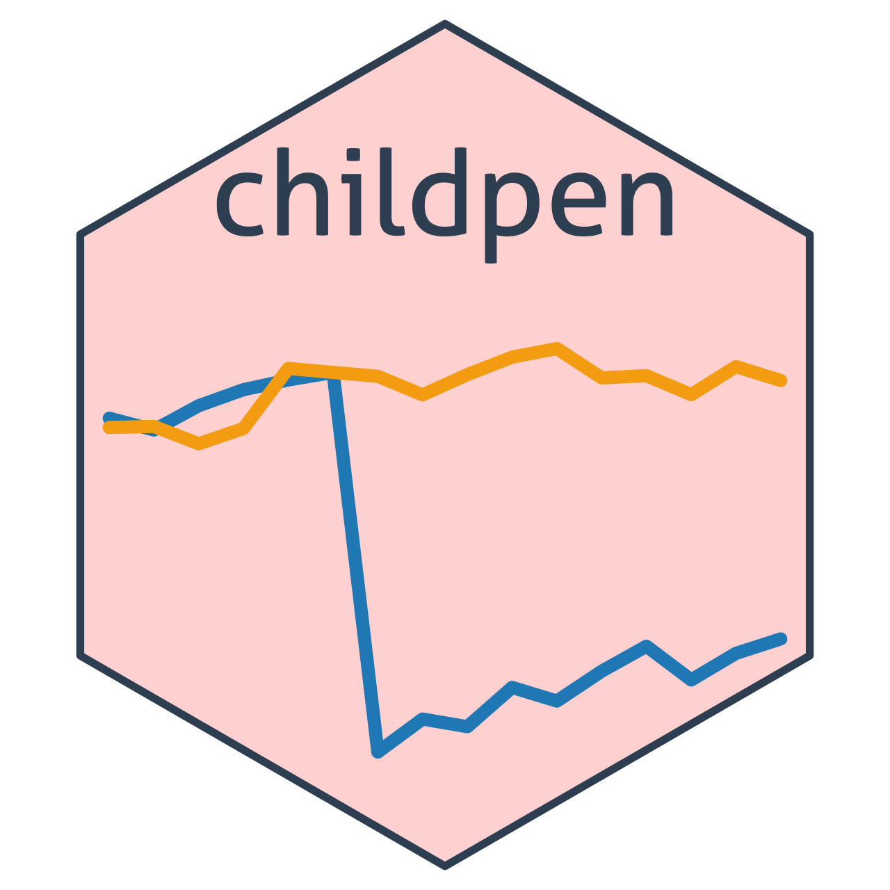

<!-- README.md is generated from README.Rmd. Please edit that file -->

# childpen <a href="https://dorleventer.github.io/childpen" title="childpen website"></a>

<!-- badges: start -->

[](https://github.com/dorleventer/childpen/actions/workflows/pkgdown.yaml)
[](LICENSE)
<!-- badges: end -->

**childpen: Child Penalties Estimators & Simulation Tools**

> This package accompanies my job market paper:  
> **Leventer, Dor (2025).** *Identification of Child Penalties.*  
> [Preprint (coming soon)](#)

- 🧪 DID / TD / NTD estimators (single & multiple treatment groups)
- 🧰 Simulation tools  
- 💻 **GitHub:** <https://github.com/dorleventer/childpen>  
- 🌐 **Website:** <https://dorleventer.github.io/childpen> *(auto-built
  with pkgdown)*

------------------------------------------------------------------------

## Roadmap

**Package functions**

- [x] **Estimation of single 2×2** — `single_treatment_group_analysis()`
- [x] **Wrapper for multiple 2×2** —
  `multiple_treatment_group_analysis()`
- [x] **Data simulation** — `simulate_data()`
- [ ] **Aggregation over multiple groups**

**Explainers**

- [x] **Data simulation** —
  [vignette](https://dorleventer.github.io/childpen/articles/simulation.html)
- [x] **Intuition for NTD bias** —
  [vignette](https://dorleventer.github.io/childpen/articles/NTD-identification.html)
- [ ] **DID estimation**
- [ ] **TD bias**
- [ ] **TD estimation**
- [ ] **NTD baseline, alternative, and bias-corrected estimation**
- [ ] **Validation tests**
- [ ] **Aggregate estimates**

------------------------------------------------------------------------

## Installation

Install the latest development version from GitHub:

``` r
# install.packages("remotes")
remotes::install_github("dorleventer/childpen")
#> Using GitHub PAT from the git credential store.
#> Skipping install of 'childpen' from a github remote, the SHA1 (03e30b06) has not changed since last install.
#>   Use `force = TRUE` to force installation
```
