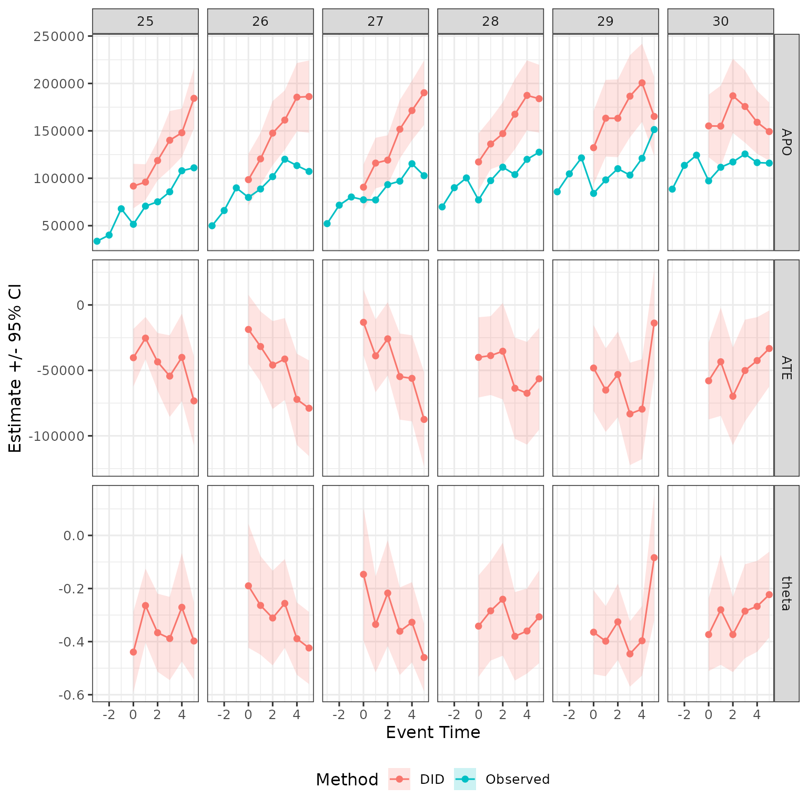
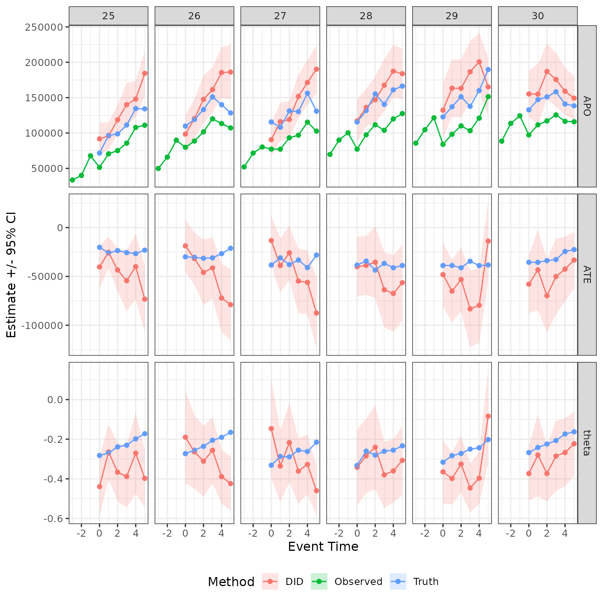
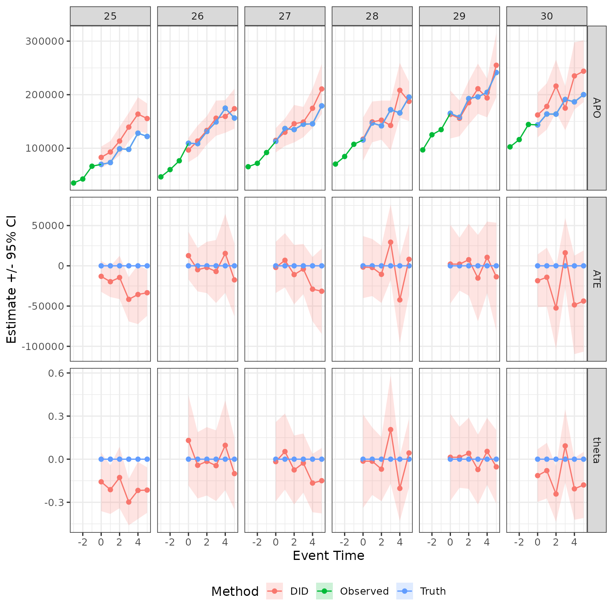

# DID-estimation

## Overview

The aim of this vignette is show how to estimate difference in
differences (DID) using closest-not-yet-treated control groups using
`childpen`.

## Simulate data

The package has a built in simulation function to draw data resembling
child penalty studies.

``` r

library(childpen)

N <- 2000
data <- simulate_data(n_individuals = N)
head(data)
#>   id female age  D  Y_inf      Y
#> 1  1      1  20 25  32193  32193
#> 2  1      1  21 25  46159  46159
#> 3  1      1  22 25  79432  79432
#> 4  1      1  23 25  75703  75703
#> 5  1      1  24 25 291366 291366
#> 6  1      1  25 25 139286  94345
```

## DID Estimands and Estimators

DIDs starting point is a $`2\times2`$ comparison. We consider some
treatment group $`d`$ (e.g., 25), and want to effects for some target
age $`a`$ (e.g., 30). The pre-treatment period is initially set to
$`d-1`$ (e.g., 24), but this can be changed in `childpen` using the
argument `pre`. The control group $`d^\prime`$ is always set to the
closest-not-yet-treated group, i.e., `childpen` automatically sets
$`d^\prime=a+1`$. For example, for target age $`a=30`$, the closest
group that is not yet treated is parents that had their first child at
31.

DID calculates average potential outcomes in the counterfactual without
childbirth by adding to the treatment group $`d`$ the trend for the
control group $`d^\prime`$ between ages $`d-1`$ and $`a`$. Let
$`G\in\{f,m\}`$ be female or male gender, $`D`$ the age at first
childbirth, $`Y`$ the outcome. We write the DID counterfactual average
potential outcomes as
``` math
\delta_{\mathrm{APO}}(g,d,d^\prime,a)=\mathbb{E}[Y_{d-1}\mid G=g, D=d]+\mathbb{E}[Y_a-Y_{d-1}\mid G=g, D=d^\prime].
```
The DID average treatment effect (in levels) for defined for gender
$`g`$ and treatment group $`d`$ is written as
``` math
\delta_{\mathrm{ATE}}(g,d,d^\prime,a)=\mathbb{E}[Y_a\mid G=g, D=d]-\delta_{\mathrm{APO}}(g,d,d^\prime,a)
```
Finally, in the child penalty application, many studies consider a
normalized target, which divides the level effects by the estimated
counterfactual. DID can calculate that via
``` math
\delta_{\theta}(g,d,d^\prime,a)=\frac{\delta_{\mathrm{ATE}}(g,d,d^\prime,a)}{\delta_{\mathrm{APO}}(g,d,d^\prime,a)}
```
All $`\delta`$s are descriptive estimands. Descriptive, in the sense
that the do not include potential outcomes, only observable data.
Estimands, in the sense that they include population expectations.

The equivalent estimators simply replace population estimands with
sample means. Since all estimators are combinations of simple averages,
it is easy to construct influence functions with which variances can be
estimated. For more details, see the estimation appendix in the paper.

## Multiple treatment group analysis

We will now do the main heavy lifting. Say you want to estimate DID with
closest-not-yet-treated control groups. This will be many $`2\times2`$s.
`childpen` easily allows it using the wrapper function below,
[`multiple_treatment_group_analysis()`](https://dorleventer.github.io/childpen/reference/multiple_treatment_group_analysis.md).
Note that the column names of the data are the same as the default for
the function, so no need to input explicitly.

``` r

res = multiple_treatment_group_analysis(data = data,
                                  treatment_groups = 25:30, # which treatment groups to run in the analysis
                                  periods_post = 5, # estimate results for post periods 0:5
                                  periods_pre = NULL, # estimate pre-trend diagnostics, set to NULL to omit from estimation
                                  max_age = 40, # dont estimate results if age is above 40
                                  min_age = 20, # dont estimate results if age is below 20
                                  pre = 1, # use 1 period before treatment, can make further away if anticipation is conern
                                  verbose = FALSE # set to TRUE to output progress (i like to time loops) set to FALSE to omit messages
                                  ) 
```

## Only DID, plot post-treatment results

The above function outputs results for all estimation methods discussed
in the paper. Let save only DID results, and graph them. For
benchmarking, I also add to the plots the mean observed earnings from
the raw data.

``` r

obs_tidy = data |> 
  mutate(event_time = age - D) |> 
  rename(d = D) |> 
  group_by(female, d, event_time) |> 
  summarize(est = mean(Y)) |> 
  mutate(estimand = "APO", method = "Observed") |> 
  filter(event_time %in% -3:5, d %in% 25:30)

plot_data = res |> 
  filter(method %in% c("DID_Female", "DID_Male")) |> 
  mutate(female = ifelse(method == "DID_Female", 1, 0)) |> 
  select(d, event_time, estimand, female, est, ci_l, ci_h) |> 
  mutate(method = "DID")

plot_data = plot_data |> 
  dplyr::bind_rows(obs_tidy)

plot_data |> 
  filter(female == 1) |> 
  ggplot(aes(x = event_time, y = est, ymin = ci_l, ymax = ci_h, color = method, fill = method)) + 
  geom_ribbon(color = NA, alpha = .2) +
  geom_point() + geom_line() + 
  facet_grid(cols = vars(d), rows = vars(estimand), scales = "free") + 
  labs(x = "Event Time", y = "Estimate +/- 95% CI", color = "Method", fill = "Method") + 
  theme(legend.position = "bottom")
```



## Compare to real effects in the simulation

The simulation offers also potential outcomes so we can see effect: Null
for fathers and 30% decline with some constant recovery for mothers.

``` r

PO_tidy = data |> 
  mutate(event_time = age - D) |> 
  rename(d = D) |> 
  group_by(female, d, event_time) |> 
  summarize(APO_obs = mean(Y), APO = mean(Y_inf)) |> 
  mutate(ATE = APO_obs - APO, 
         theta = ATE / APO) |> 
  filter(event_time %in% 0:5, d %in% 25:30) |> 
  select(-APO_obs) |> 
  pivot_longer(
    !c(female, d, event_time), names_to = "estimand", values_to = "est"
  ) |> 
  mutate(method = "Truth")

plot_data = plot_data |> 
  dplyr::bind_rows(PO_tidy)

plot_data |> 
  filter(female == 1) |> 
  ggplot(aes(x = event_time, y = est, ymin = ci_l, ymax = ci_h, color = method, fill = method)) + 
  geom_ribbon(color = NA, alpha = .2) +
  geom_point() + geom_line() + 
  facet_grid(cols = vars(d), rows = vars(estimand), scales = "free") + 
  labs(x = "Event Time", y = "Estimate +/- 95% CI", color = "Method", fill = "Method") + 
  theme(legend.position = "bottom")
```



The intuition for this result, discussed in the paper, is that later
treatment groups are positively selected compared to earlier treatment
groups, and hence DID is overstating treatment effects for those groups.

## For completness, show for men as well

``` r

plot_data |> 
  filter(female == 0) |> 
  ggplot(aes(x = event_time, y = est, ymin = ci_l, ymax = ci_h, color = method, fill = method)) + 
  geom_ribbon(color = NA, alpha = .2) +
  geom_point() + geom_line() + 
  facet_grid(cols = vars(d), rows = vars(estimand), scales = "free") + 
  labs(x = "Event Time", y = "Estimate +/- 95% CI", color = "Method", fill = "Method") + 
  theme(legend.position = "bottom")
```



## Validation tests

For a discussion on how to perform validation tests, and what type of
tests are correct for this type of estimation, see the validation test
vignette.
