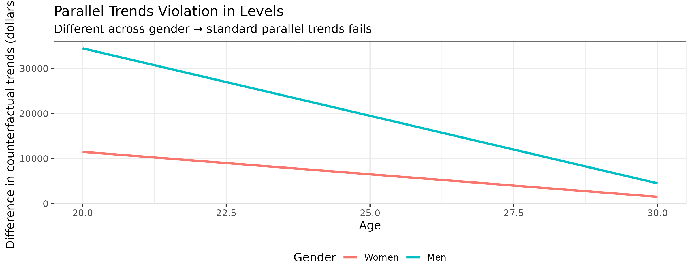
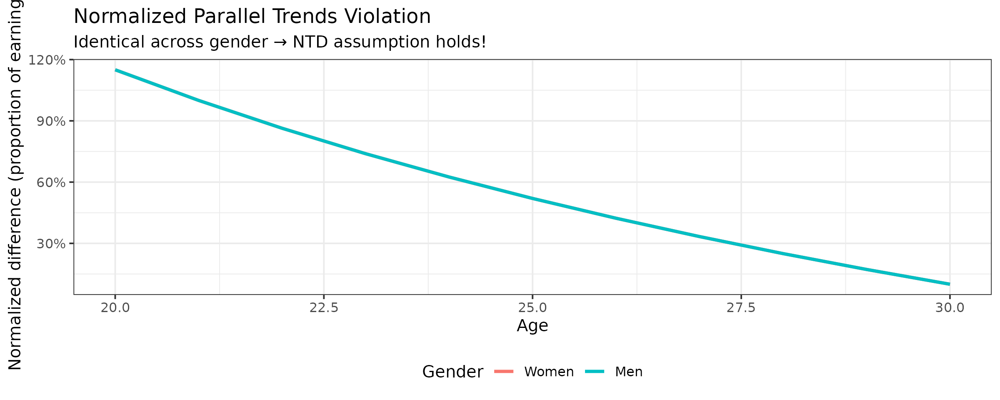
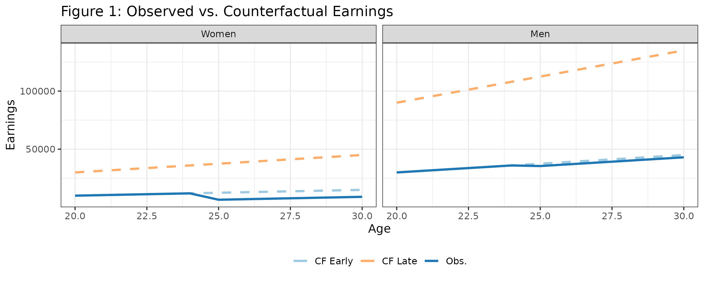
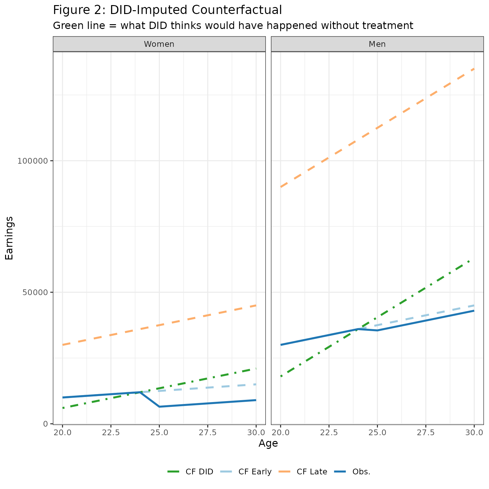
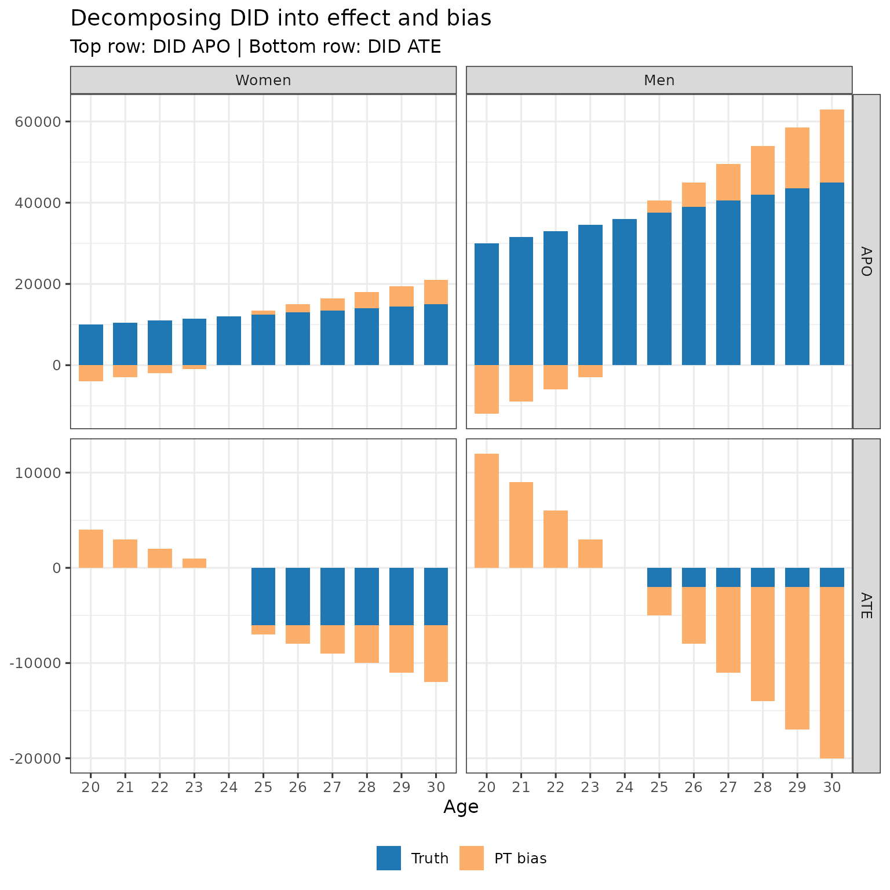
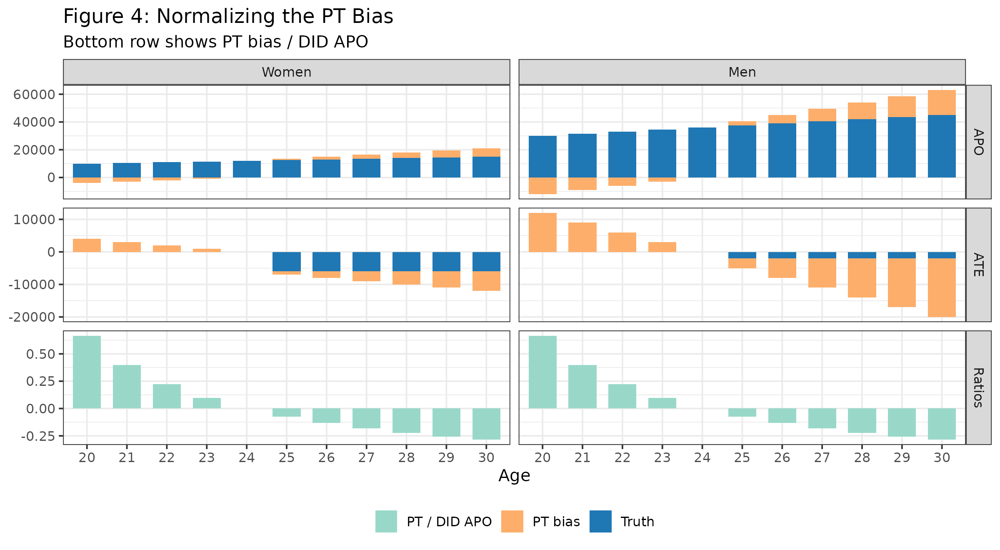
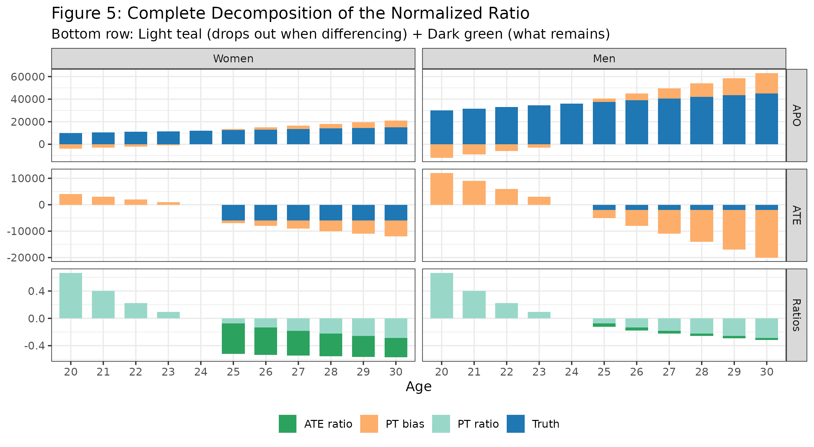
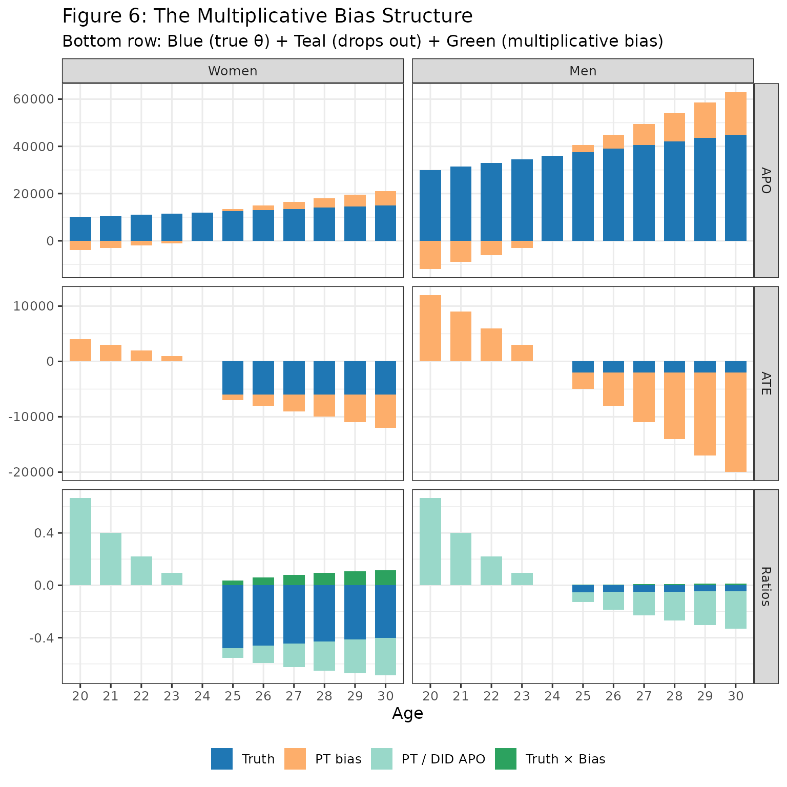

# NTD-identification

> **Notation.** For symbol definitions used throughout these vignettes,
> see the [simulation
> vignette](https://dorleventer.github.io/childpen/articles/simulation.md).
> For the formal identification results, see [Leventer
> (2025)](https://arxiv.org/abs/2602.07486).

> **Note.** This vignette uses a stylised DGP designed to make the NTD
> identification assumption hold exactly by construction. The treatment
> effects and earnings levels are chosen for pedagogical clarity, not to
> reproduce the empirical magnitudes in the paper.

## Overview

The aim of this vignette is to create intuition on the normalized triple
differences (NTD) identification framework discussed in the paper.
Specifically, it analyzes the `NTD_Conv` (conventional) estimand — the
gender gap in normalised effects, $`\theta(f) - \theta(m)`$. For the
alternative `NTD_New` estimand ($`\Delta\rho`$), see the [TD-NTD
estimation
vignette](https://dorleventer.github.io/childpen/articles/TD-NTD-estimation.md).
NTD is the underlying identification framework for normalized event
studies, a common empirical strategy in the child penalty literature.

**This vignette demonstrates:**

1.  The NTD identification assumption
2.  The bias that emerges from normalizing under this assumption

We’ll use a simple data generating process (DGP) to visualize
everything. You are encouraged to play with the code to see how the bias
changes under different parameters.

------------------------------------------------------------------------

## The DGP

We create a DGP with:

- Two genders: women and men (with men earning more)
- Two treatment cohorts: early (D=25) and late (D=30)  
- Linear earnings growth, with late cohorts have steeper slopes
- Earnings penalties from childbirth

The key feature: when taking ratios within gender, the difference
between men and women is netted out

``` r

# Parameters
baseline    <- 500
ratio_bias  <- 3    # late vs early slope multiplier
ratio_apos  <- 3    # men vs women slope multiplier
ages        <- 20:30
d_early     <- 25
d_late      <- 30

# Counterfactual earning slopes
s_f_25 <- baseline
s_f_30 <- baseline * ratio_bias
s_m_25 <- baseline * ratio_apos
s_m_30 <- baseline * ratio_apos * ratio_bias

# Treatment effects (ATT)
att_f  <- -6000
att_m  <- -2000

# Build each group
make_group <- function(sex, D, slope, att_level) {
  tibble(
    age    = ages,
    female = sex,
    D      = D,
    y_0    = slope * age,           # counterfactual (no treatment)
    y_1    = y_0 + ifelse(age >= D, att_level, 0),
    y      = y_1                     # observed
  )
}

data <- bind_rows(
  make_group(1, d_early, s_f_25, att_f),
  make_group(1, d_late,  s_f_30, att_f),
  make_group(0, d_early, s_m_25, att_m),
  make_group(0, d_late,  s_m_30, att_m)
)
```

## Verifying the NTD Assumption Holds

Recall, that NTD assumes that normalized violations of parallel trends
are equal across genders.

Before visualizing the bias, let’s verify that this DGP actually
satisfies this assumption.

### Parallel trends violation in levels

First, let’s calculate the parallel trend violation in levels - the
difference in counterfactual trends between early and late treated
within gender:

``` r

# Calculate trend from pre-treatment (age D-1) to each subsequent age
trends <- function(g, d, a) {
  pre <- data |> filter(D == d, female == g, age == d-1) |> pull(y_0)
  post <- data |> filter(D == d, female == g, age == a) |> pull(y_0)
  post - pre
}

# Difference in trends between early and late cohorts
diff_trends <- function(g, a) trends(g, 25, a) - trends(g, 30, a)

expand_grid(
  female = c(0, 1),
  age    = ages
) |>
  mutate(
    diff_trend = purrr::map2_dbl(female, age, diff_trends),
    gender = factor(if_else(female == 1, "Women", "Men"), levels = c("Women", "Men"))
  ) |> 
  ggplot(aes(x = age, y = diff_trend, color = gender)) + 
  geom_line(linewidth = 1.1) + 
  labs(
    title = "Parallel Trends Violation in Levels by Gender",
    x = "Age", 
    y = "Difference in counterfactual trends", 
    color = "Gender"
  ) +
  theme(legend.position = "bottom")
```



The parallel trends violations in levels are **not equal** across
gender. Men’s violations are much larger because they have higher
earnings. This violates both difference-in-differences (DID), which
assumes no violation, and triple differences (TD), which assumes equal
violations in levels across genders.

### Normalized parallel trends violation

Now let’s normalize by dividing by the average potential earnings (APO —
average potential outcome, counterfactual earnings absent children) in
the absence of treatment:

``` r

# Get counterfactual earnings for early cohort (APO)
get_apo <- function(g, a) {
  data |>
    dplyr::filter(D == 25, female == g, age == a) |>
    dplyr::pull(y_0)
}

expand_grid(
  female = c(0, 1),
  age    = ages
) |>
  mutate(
    diff_trend = purrr::map2_dbl(female, age, diff_trends),
    y_0 = purrr::map2_dbl(female, age, get_apo),
    norm_diff_trend = diff_trend / y_0,
    gender = factor(if_else(female == 1, "Women", "Men"), levels = c("Women", "Men"))
  ) |> 
  ggplot(aes(x = age, y = norm_diff_trend, color = gender)) + 
  geom_line(linewidth = 1.1) + 
  labs(
    title = "Normalized Parallel Trends Violation",
    x = "Age", 
    y = "Normalized difference in counterfactual trends", 
    color = "Gender"
  ) +
  scale_y_continuous(labels = scales::percent_format()) +
  theme(legend.position = "bottom")
```



**Takeaway:** The normalized parallel trends violations are identical
for men and women at every age. This is exactly what the NTD
identification assumption requires.

**Why does this work?** By construction, late cohort slopes are a
constant multiple of early slopes (within gender), and men’s slopes are
a constant multiple of women’s slopes (within cohort). These constant
multiples for men cancel out when we take ratios, ensuring the
normalized PT violations are equal across gender.

–

## The Setup - Counterfactuals and Observed Data

Let’s start by seeing what we observe vs. the true counterfactuals:

``` r

plot_df <- bind_rows(
  # Early cohort: observed and counterfactual
  data %>%
    filter(D == d_early) %>%
    pivot_longer(cols = c(y_0, y), names_to = "series", values_to = "value"),
  # Late cohort: counterfactual only (not yet treated at these ages for early cohort)
  data %>%
    filter(D == d_late) %>%
    transmute(age, female, D, series = "y_0", value = y_0)
) %>%
  mutate(
    gender = factor(if_else(female == 1, "Women", "Men"), levels = c("Women", "Men")),
    cohort = factor(if_else(D == d_early, "Early (D=25)", "Late (D=30)"),
                    levels = c("Early (D=25)", "Late (D=30)")),
    series_label = case_when(
      cohort == "Early (D=25)" & series == "y"   ~ "Early — Observed",
      cohort == "Early (D=25)" & series == "y_0" ~ "Early — Counterfactual",
      cohort == "Late (D=30)"  & series == "y_0" ~ "Late — Counterfactual"
    ),
    linetype = if_else(series_label == "Early — Observed", "solid", "dashed"),
    color = case_when(
      series_label == "Early — Observed"       ~ "Obs.",
      series_label == "Early — Counterfactual" ~ "CF Early",
      TRUE                                     ~ "CF Late"
    )
  )

ggplot(plot_df, aes(x = age, y = value, group = series_label)) +
  geom_line(aes(linetype = linetype, color = color), linewidth = 1.1) +
  facet_wrap(~ gender, nrow = 1) +
  scale_linetype_identity() +
  scale_color_manual(
    values = c("Obs." = "#1f77b4", "CF Early" = "#9ecae1", "CF Late" = "#fdae6b")
  ) +
  labs(
    title = "Figure 1: Observed vs. Counterfactual Earnings",
    x = "Age", y = "Earnings", color = NULL
  ) +
  theme(legend.position = "bottom")
```



- The solid blue line shows what we observe for the early cohort after
  treatment at age 25
- Light blue dashed: what would have happened without treatment (early
  cohort)
- Orange dashed: counterfactual for late treatment group
- The gap between solid and light blue dashed = average treatment effect
  (ATE)

**The problem:** We don’t observe the light blue line. We need to impute
it somehow.

## The DID Approach - Using Late Cohort as Control

DID uses the trend of the late cohort to impute the counterfactual for
the early cohort:

``` r

# Calculate DID-imputed counterfactual
did_cf <- bind_rows(lapply(c(1, 0), function(g) {
  # Early cohort's pre-treatment level
  early_pre <- data %>%
    filter(female == g, D == d_early, age == d_early - 1) %>%
    pull(y)
  
  # Late cohort trend
  late_cf <- data %>% filter(female == g, D == d_late) %>% select(age, y_0)
  late_pre <- late_cf %>% filter(age == d_early - 1) %>% pull(y_0)
  
  # DID imputation: shift late trend to match early pre-treatment level
  tibble(
    age    = late_cf$age,
    female = g,
    D      = d_early,
    series = "y_cf_did",
    value  = early_pre + (late_cf$y_0 - late_pre)
  )
})) %>%
  mutate(
    gender = factor(if_else(female == 1, "Women", "Men"), levels = c("Women", "Men")),
    cohort = factor("Early (D=25)", levels = c("Early (D=25)", "Late (D=30)")),
    series_label = "Early — DID-imputed CF",
    linetype = "dotdash",
    color = "CF DID"
  )

plot_df_plus <- bind_rows(plot_df, did_cf)

ggplot(plot_df_plus, aes(x = age, y = value, group = series_label)) +
  geom_line(aes(linetype = linetype, color = color), linewidth = 1.1) +
  facet_wrap(~ gender, nrow = 1) +
  scale_linetype_identity() +
  scale_color_manual(
    values = c(
      "Obs." = "#1f77b4", "CF Early" = "#9ecae1", 
      "CF Late" = "#fdae6b", "CF DID" = "#2ca02c"
    )
  ) +
  labs(
    title = "Figure 2: DID-Imputed Counterfactual",
    subtitle = "Green line = what DID thinks would have happened without treatment",
    x = "Age", y = "Earnings", color = NULL
  ) +
  theme(legend.position = "bottom")
```



The green line (DID imputed counterfactual) doesn’t match the light blue
line (true counterfactual). This difference is bias due to parallel
trend violations. It happens because the late cohort has a steeper slope
for counterfactual earnings.

## Decomposing DID Estimates into Truth and Bias

Let’s break down what DID gives us. First, in the above figure, we have:

- DID APO (green line)
- Truth APO (light blue line)
- DID ATE (difference between observed earnings and green line)
- Truth ATE (difference between observed earnings and light blue line)
- PT Bias (difference between green and light blue lines)

For each age, we can decompose:

- DID APO = True APO + PT Bias
- DID ATE = True ATE - PT Bias (DID ATE is difference between orange and
  green lines, so PT bias comes here in minus)

Below, I calculate the APO and ATE under DID. And then show the
decomposition of these value, by age and gender, into truth and bias.

``` r

# Calculate true APO and ATE
early_true_age <- data %>%
  filter(D == d_early) %>%
  group_by(female, age) %>%
  summarise(APO_true = y_0, APO_obs = y, .groups = "drop") |> 
  mutate(ATE_true = APO_obs - APO_true)

# Calculate DID APO
early_did_age <- did_cf %>%
  group_by(female, age) %>%
  summarise(APO_did = value, .groups = "drop")

# Combine and calculate bias
summary_age <- early_true_age %>%
  left_join(early_did_age, by = c("female", "age")) %>%
  mutate(
    PT_bias = APO_did - APO_true,  # parallel trends bias
    ATE_did = APO_obs - APO_did,  # DID ATE = truth - PT bias
    gender  = factor(if_else(female == 1, "Women", "Men"), levels = c("Women", "Men"))
  )

# Prepare stacked bar chart data
apo_stack_age <- summary_age %>%
  transmute(
    gender, age = factor(age),
    measure = factor("APO", levels = c("APO", "ATE")),
    total = APO_did, comp_true = APO_true, comp_bias = PT_bias
  ) %>%
  pivot_longer(c(comp_true, comp_bias), names_to = "component", values_to = "value") %>%
  mutate(component = if_else(component == "comp_true", "Truth", "PT bias"))

ate_stack_age <- summary_age %>%
  transmute(
    gender, age = factor(age),
    measure = factor("ATE", levels = c("APO", "ATE")),
    total = ATE_did, comp_true = ATE_true, comp_bias = -PT_bias
  ) %>%
  pivot_longer(c(comp_true, comp_bias), names_to = "component", values_to = "value") %>%
  mutate(component = if_else(component == "comp_true", "Truth", "PT bias"))

bar_age_df <- bind_rows(apo_stack_age, ate_stack_age)

ggplot(bar_age_df, aes(x = age, y = value, fill = component)) +
  geom_col(width = 0.7) +
  facet_grid(rows = vars(measure), cols = vars(gender), scales = "free_y") +
  scale_fill_manual(
    values = c("Truth" = "#1f77b4", "PT bias" = "#fdae6b"),
    breaks = c("Truth", "PT bias")
  ) +
  labs(
    title = "Decomposing DID into effect and bias",
    subtitle = "Top row: DID APO | Bottom row: DID ATE",
    x = "Age", y = NULL, fill = NULL
  ) +
  theme(legend.position = "bottom")
```



This is not surprising: when counterfactual trends are not equal, DID
does not identify the APO, and hence doesn’t identify the ATE.

## The Bias from Normalizing

Now for the key question: **What happens when we normalize?**

In NTD, we compute:
``` math
\delta_{\theta} = \frac{\text{DID ATE}}{\text{DID APO}}
```

This is meant to estimate the true ratio:
``` math
\theta = \frac{\text{True ATE}}{\text{True APO}}
```

where $`\theta = \text{ATE}/\text{APO}`$ is the normalised effect (the
causal estimand we care about).

### Step 1: The PT Bias Component

Note that
``` math
\delta_{\theta} = \frac{\text{DID ATE}}{\text{DID APO}}=\frac{\text{TRUE ATE} - \text{PT Bias}}{\text{DID APO}}=\frac{\text{TRUE ATE}}{\text{DID APO}}-\frac{\text{PT Bias}}{\text{DID APO}}
```

We will now analyze each of the two terms:
$`\frac{\text{TRUE ATE}}{\text{DID APO}}`$ and
$`-\frac{\text{PT Bias}}{\text{DID APO}}`$. Start with the second term.

``` r

pt_ratio_df <- summary_age %>%
  transmute(
    gender, age = factor(age),
    measure = factor("Ratios", levels = c("APO","ATE","Ratios")),
    component = "PT / DID APO",
    value = -PT_bias / APO_did
  )

bar_age_three <- bind_rows(
  apo_stack_age %>% mutate(measure = factor("APO", levels = c("APO","ATE","Ratios"))),
  ate_stack_age %>% mutate(measure = factor("ATE", levels = c("APO","ATE","Ratios"))),
  pt_ratio_df
)

ggplot(bar_age_three, aes(x = age, y = value, fill = component)) +
  geom_col(width = 0.7) +
  facet_grid(rows = vars(measure), cols = vars(gender), scales = "free_y") +
  scale_fill_manual(
    values = c(
      "Truth" = "#1f77b4", "PT bias" = "#fdae6b", "PT / DID APO" = "#99d8c9"
    )
  ) +
  labs(
    title = "Figure 4: Normalizing the PT Bias",
    subtitle = "Bottom row shows PT bias / DID APO",
    x = "Age", y = NULL, fill = NULL
  ) +
  theme(legend.position = "bottom")
```



**Takeaway:** The bottom row (PT / DID APO) is **identical for men and
women** at every age. Hence, under NTD, differencing across gender
cancels out this bias parameter.

We now continue with the second component

### Step 2: The Effect Component

Now let’s add the second part of the sum,
$`\frac{\text{ATE}}{\text{DID APO}}`$.

``` r

ratios_df <- summary_age %>%
  transmute(
    gender, age = factor(age),
    measure = factor("Ratios", levels = c("APO","ATE","Ratios")),
    `PT ratio`  = -PT_bias / APO_did,
    `ATE ratio` = ATE_true / APO_did
  ) %>%
  pivot_longer(
    cols = c(`PT ratio`, `ATE ratio`), 
    names_to = "component", 
    values_to = "value"
  )

bar_age_three2 <- bind_rows(
  apo_stack_age %>% mutate(measure = factor("APO", levels = c("APO","ATE","Ratios"))),
  ate_stack_age %>% mutate(measure = factor("ATE", levels = c("APO","ATE","Ratios"))),
  ratios_df
)

ggplot(bar_age_three2, aes(x = age, y = value, fill = component)) +
  geom_col(width = 0.7) +
  facet_grid(rows = vars(measure), cols = vars(gender), scales = "free_y") +
  scale_fill_manual(
    values = c(
      "Truth" = "#1f77b4", "PT bias" = "#fdae6b",
      "PT ratio" = "#99d8c9", "ATE ratio" = "#2ca25f"
    )
  ) +
  labs(
    title = "Figure 5: Complete Decomposition of the Normalized Ratio",
    subtitle = "Bottom row: Light teal (drops out when differencing) + Dark green (what remains)",
    x = "Age", y = NULL, fill = NULL
  ) +
  theme(legend.position = "bottom")
```



The bottom row shows:

- Light teal (PT / DID APO): Same across gender $`\rightarrow`$ cancels
  when we difference between gender
- Dark green (ATE / DID APO): Different across gender

Now we need to examine, if we difference (ATE / DID APO) between gender,
does this capture the gender gap in normalized effects?

## The Multiplicative Bias

Here’s where it gets interesting. The (ATE / DID APO) (dark green in
above figure) can be rewritten to reveal a multiplicative bias:

``` math
\frac{\text{True ATE}}{\text{DID APO}} = \frac{\text{True APO} \cdot \theta}{\text{DID APO}} = \theta \cdot \frac{\text{True APO}}{\text{DID APO}}
```

where, recall, $`\theta = \text{True ATE} / \text{True APO}`$ is the
causal estimand we are interested in. Or, at least, the gender gap in
normalised effects, $`\theta(f) - \theta(m)`$.

Adding and subtracting $`\theta`$, and using the definition of DID APO =
True APO + PT Bias, we can re-write the above as
``` math
\begin{aligned}
\frac{\text{True ATE}}{\text{DID APO}} &= \theta \frac{\text{True APO}}{\text{DID APO}} \\
&= \theta - \theta + \theta \frac{\text{True APO}}{\text{DID APO}} \\
&= \theta + \theta \left(\frac{\text{True APO}}{\text{DID APO}} - 1\right) \\
&= \theta + \theta \left(\frac{\text{True APO - True APO - PT Bias}}{\text{DID APO}}\right) \\
&= \theta - \theta \left(\frac{\text{PT Bias}}{\text{DID APO}}\right)
\end{aligned}
```

The second term is **multiplicative bias** - the true effect gets scaled
by the ratio of PT bias to DID APO. As we discussed above, this quantity
$`\frac{\text{PT bias}}{\text{DID APO}}`$ is constant between genders.
So both genders treatment effects are scaled by the same factor.

``` r


## sanity check
summary_age %>%
  transmute(
    gender, age = factor(age),
    measure = factor("Ratios", levels = c("APO","ATE","Ratios")),
    `ATE ratio` = ATE_true / APO_did,
    `ATE ratio check` = (ATE_true / APO_true) - (ATE_true / APO_true) * (PT_bias / APO_did)
  )
#> # A tibble: 22 × 5
#>    gender age   measure `ATE ratio` `ATE ratio check`
#>    <fct>  <fct> <fct>         <dbl>             <dbl>
#>  1 Men    20    Ratios       0                 0     
#>  2 Men    21    Ratios       0                 0     
#>  3 Men    22    Ratios       0                 0     
#>  4 Men    23    Ratios       0                 0     
#>  5 Men    24    Ratios       0                 0     
#>  6 Men    25    Ratios      -0.0494           -0.0494
#>  7 Men    26    Ratios      -0.0444           -0.0444
#>  8 Men    27    Ratios      -0.0404           -0.0404
#>  9 Men    28    Ratios      -0.0370           -0.0370
#> 10 Men    29    Ratios      -0.0342           -0.0342
#> # ℹ 12 more rows

theta_df <- summary_age %>%
  transmute(
    gender, age = factor(age),
    APO_true, ATE_true, APO_did, PT_bias,
    theta_true = ATE_true / APO_true,
    bias_A = -PT_bias / APO_did,
    bias_B = - theta_true * (PT_bias / APO_did)
  )

theta_stack <- bind_rows(
  theta_df %>% transmute(
    gender, age, measure = factor("Ratios", levels = c("APO","ATE","Ratios")),
    component = "Truth", value = theta_true
  ),
  theta_df %>% transmute(
    gender, age, measure = factor("Ratios", levels = c("APO","ATE","Ratios")),
    component = "Bias A", value = bias_A
  ),
  theta_df %>% transmute(
    gender, age, measure = factor("Ratios", levels = c("APO","ATE","Ratios")),
    component = "Bias B", value = bias_B
  )
)

bar_age_three3 <- bind_rows(
  apo_stack_age %>% mutate(measure = factor("APO", levels = c("APO","ATE","Ratios"))),
  ate_stack_age %>% mutate(measure = factor("ATE", levels = c("APO","ATE","Ratios"))),
  theta_stack
)

ggplot(bar_age_three3, aes(x = age, y = value, fill = component)) +
  geom_col(width = 0.7) +
  facet_grid(rows = vars(measure), cols = vars(gender), scales = "free_y") +
  scale_fill_manual(
    values = c(
      "Truth" = "#1f77b4", "PT bias" = "#fdae6b",
      "Bias A" = "#99d8c9", "Bias B" = "#2ca25f"
    ),
    breaks = c("Truth", "PT bias", "Bias A", "Bias B"),
    labels = c("Truth", "PT bias", "PT / DID APO", "Truth × Bias")
  ) +
  labs(
    title = "Figure 6: The Multiplicative Bias Structure",
    subtitle = "Bottom row: Blue (true θ) + Teal (drops out) + Green (multiplicative bias)",
    x = "Age", y = NULL, fill = NULL
  ) +
  theme(legend.position = "bottom")
```



**Bottom row interpretation:**

- **Blue (Truth)**: The true ratio $`\theta`$ we want to estimate
- **Teal (Bias A)**: PT / DID APO - drops out when differencing across
  gender
- **Green (Bias B)**:
  $`\theta \times \frac{\text{PT bias}}{\text{DID APO}}`$ - is not equal
  between gender, since $`\theta`$ is allowed to be different between
  gender $`\rightarrow`$ hence bias remains when differencing

Note that the size of bias (in Bias B in the above plot) depends on
relation of PT bias to APO (where this relation is constant by gender
under NTD).
