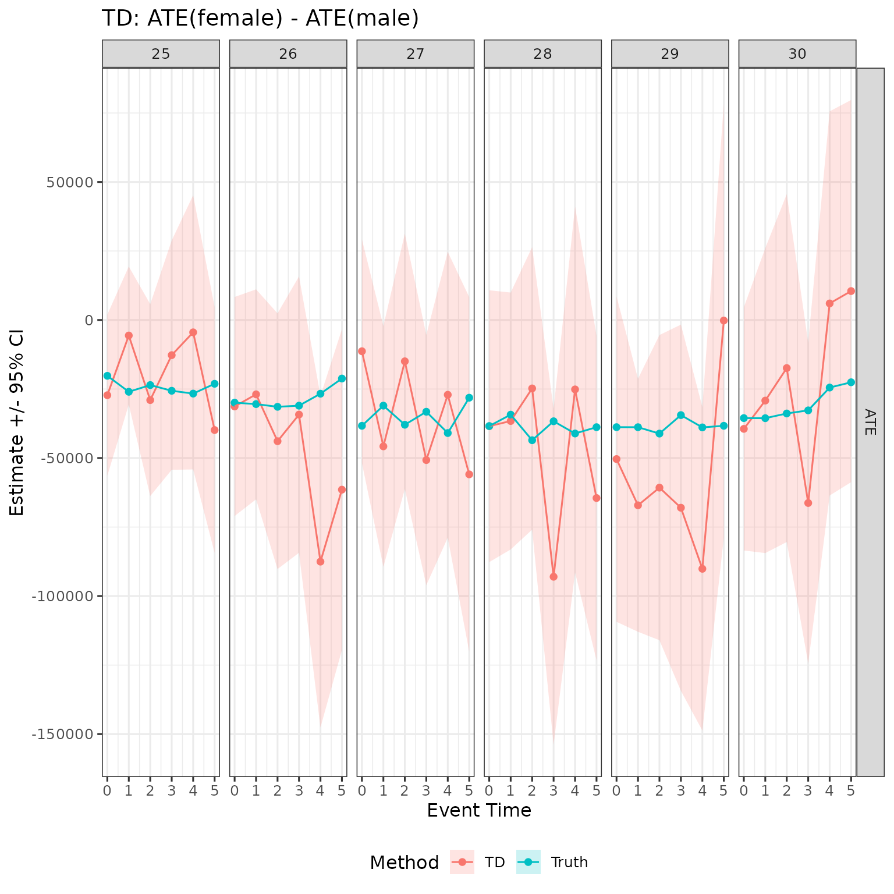
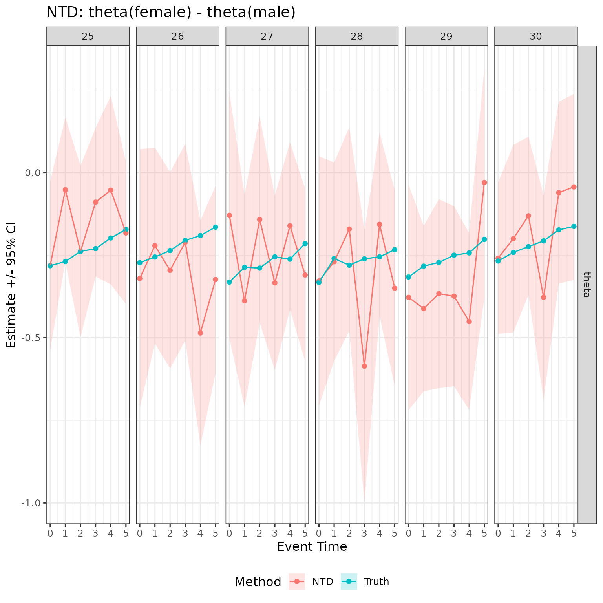
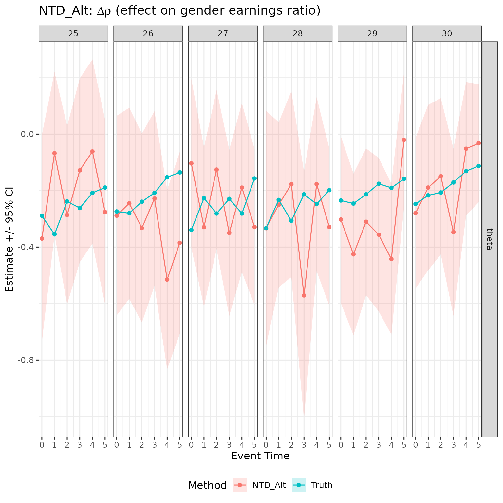
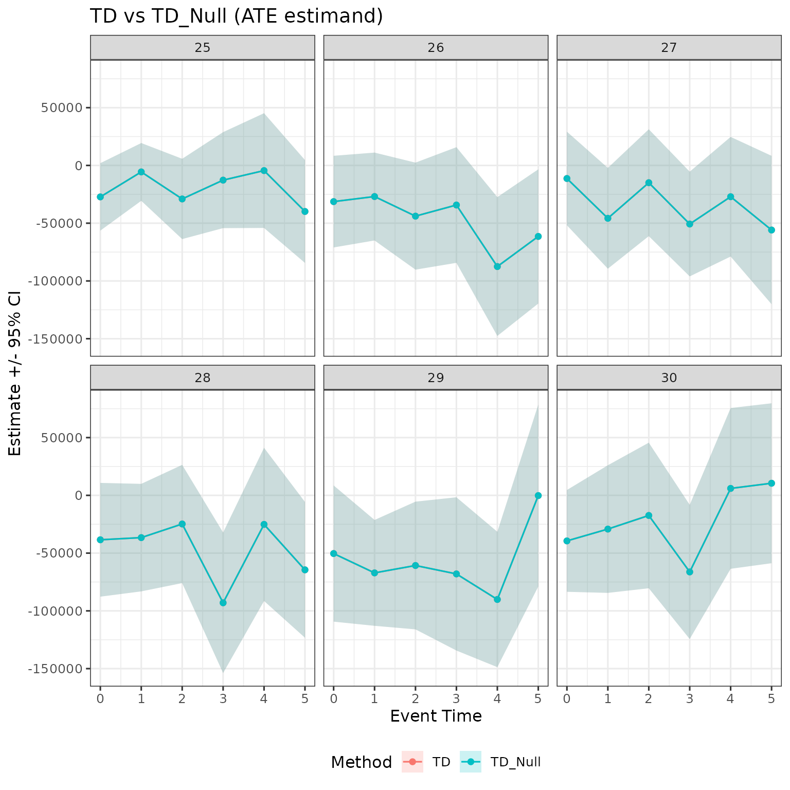
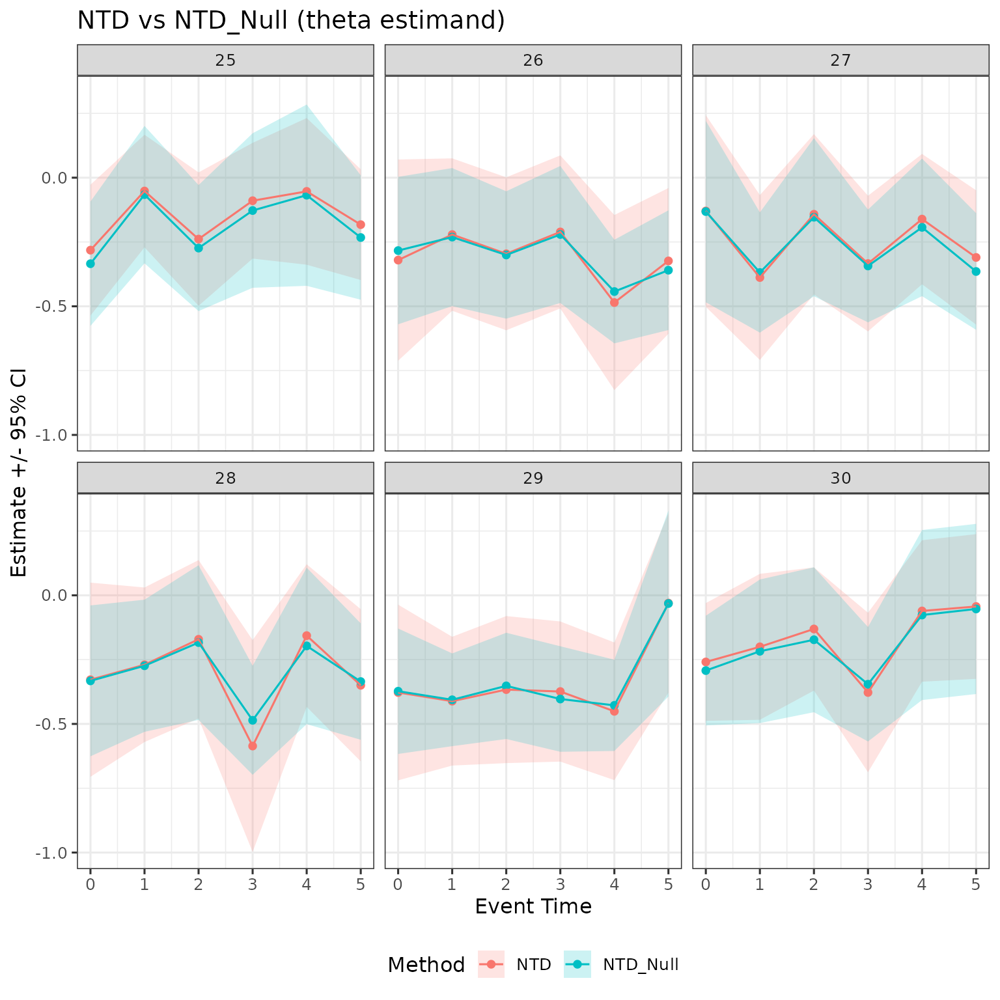

# TD-NTD-estimation

## Overview

This vignette covers the gender-gap estimands returned by
[`multiple_treatment_group_analysis()`](https://dorleventer.github.io/childpen/reference/multiple_treatment_group_analysis.md):
**TD**, **NTD**, and **NTD_Alt**. For the underlying gender-specific DID
estimands (DID_Female, DID_Male) that these build on, see the
DID-estimation vignette.

All three estimands compare the female and male child-penalty estimates
to characterise the *gender earnings gap* induced by parenthood.

**TD** (Treatment Difference) is the gap in levels:
``` math
\mathrm{TD}(d, d^\prime, a) = \delta_{\mathrm{ATE}}(f, d, d^\prime, a) - \delta_{\mathrm{ATE}}(m, d, d^\prime, a).
```
It answers: how much larger (in currency units) is the earnings drop for
mothers than for fathers?

**NTD** (Normalised Treatment Difference) is the gap in normalised
effects — what the literature calls the conventional child penalty:
``` math
\mathrm{NTD}(d, d^\prime, a) = \delta_{\theta}(f, d, d^\prime, a) - \delta_{\theta}(m, d, d^\prime, a).
```
It answers: how much larger is the proportional earnings drop for
mothers relative to their own counterfactual, compared to that of
fathers relative to theirs?

**NTD_Alt** (Alternative Normalised Treatment Difference) is a new
estimand from the paper. Instead of differencing two gender-specific
normalised effects, it measures the effect of parenthood on the *gender
earnings ratio* directly:
``` math
\mathrm{NTD\_Alt}(d, d^\prime, a) = \frac{\mathbb{E}[Y_a \mid f, D=d]}{\mathbb{E}[Y_a \mid m, D=d]} - \frac{\delta_{\mathrm{APO}}(f, d, d^\prime, a)}{\delta_{\mathrm{APO}}(m, d, d^\prime, a)} = \Delta\rho.
```
It answers: by how much does having a child reduce the female-to-male
earnings ratio, measured against what the ratio would have been without
children?

NTD and NTD_Alt differ because NTD normalises each gender’s effect by
its own counterfactual and then differences, whereas NTD_Alt normalises
the *joint* gender ratio. When the male child penalty is non-negligible,
the two estimands diverge.

## Simulate data

``` r

library(childpen)

set.seed(42)
N <- 2000
data <- simulate_data(n_individuals = N)
head(data)
#>   id female age  D  Y_inf      Y
#> 1  1      1  20 25  32193  32193
#> 2  1      1  21 25  46159  46159
#> 3  1      1  22 25  79432  79432
#> 4  1      1  23 25  75703  75703
#> 5  1      1  24 25 291366 291366
#> 6  1      1  25 25 139286  94345
```

## Run estimation

We estimate all methods jointly with
[`multiple_treatment_group_analysis()`](https://dorleventer.github.io/childpen/reference/multiple_treatment_group_analysis.md).
The function returns one row per treatment group × event time × estimand
× method combination.

``` r

res <- multiple_treatment_group_analysis(
  data             = data,
  treatment_groups = 25:30,
  periods_post     = 5,
  periods_pre      = NULL,
  max_age          = 40,
  min_age          = 20,
  pre              = 1,
  verbose          = FALSE
)
```

## Compute simulation truth

The simulation provides potential outcomes so we can benchmark every
estimand against its true value.

``` r

PO_tidy <- data |>
  mutate(event_time = age - D) |>
  rename(d = D) |>
  group_by(female, d, event_time) |>
  summarize(APO_obs = mean(Y), APO = mean(Y_inf)) |>
  mutate(ATE = APO_obs - APO,
         theta = ATE / APO) |>
  filter(event_time %in% 0:5, d %in% 25:30)

# TD truth: ATE(female) - ATE(male)
truth_td <- PO_tidy |>
  select(female, d, event_time, ATE) |>
  pivot_wider(names_from = female, values_from = ATE, names_prefix = "ATE_f") |>
  rename(ATE_female = ATE_f1, ATE_male = ATE_f0) |>
  mutate(est = ATE_female - ATE_male,
         method = "TD", estimand = "ATE",
         ci_l = NA_real_, ci_h = NA_real_,
         truth = TRUE)

# NTD truth: theta(female) - theta(male)
truth_ntd <- PO_tidy |>
  select(female, d, event_time, theta) |>
  pivot_wider(names_from = female, values_from = theta, names_prefix = "th_f") |>
  rename(th_female = th_f1, th_male = th_f0) |>
  mutate(est = th_female - th_male,
         method = "NTD", estimand = "theta",
         ci_l = NA_real_, ci_h = NA_real_,
         truth = TRUE)

# NTD_Alt truth: Y(f)/Y(m) - APO(f)/APO(m)
truth_ntd_alt <- PO_tidy |>
  select(female, d, event_time, APO_obs, APO) |>
  pivot_wider(names_from = female,
              values_from = c(APO_obs, APO),
              names_sep = "_f") |>
  rename(Y_female = APO_obs_f1, Y_male = APO_obs_f0,
         APO_female = APO_f1, APO_male = APO_f0) |>
  mutate(est = (Y_female / Y_male) - (APO_female / APO_male),
         method = "NTD_Alt", estimand = "theta",
         ci_l = NA_real_, ci_h = NA_real_,
         truth = TRUE)

truth_all <- bind_rows(truth_td, truth_ntd, truth_ntd_alt) |>
  select(d, event_time, estimand, method, est, ci_l, ci_h, truth)
```

## TD results

TD measures the gap in earnings *levels*:
$`\delta_{\mathrm{ATE}}(f) - \delta_{\mathrm{ATE}}(m)`$. A negative
value means mothers’ earnings fall more than fathers’ at that event
time, in the same units as the outcome variable.

``` r

plot_td <- res |>
  filter(method == "TD") |>
  mutate(truth = FALSE) |>
  select(d, event_time, estimand, method, est, ci_l, ci_h, truth) |>
  bind_rows(truth_all |> filter(method == "TD")) |>
  mutate(label = ifelse(truth, "Truth", "TD"))

plot_td |>
  ggplot(aes(x = event_time, y = est, ymin = ci_l, ymax = ci_h,
             color = label, fill = label)) +
  geom_ribbon(color = NA, alpha = 0.2) +
  geom_point() + geom_line() +
  facet_grid(cols = vars(d), rows = vars(estimand), scales = "free") +
  labs(x = "Event Time", y = "Estimate +/- 95% CI",
       color = "Method", fill = "Method",
       title = "TD: ATE(female) - ATE(male)") +
  theme(legend.position = "bottom")
```



TD is estimated in the same units as the outcome. Across treatment
groups, the estimates track the true gap closely, with confidence
intervals widening for later groups (smaller sample sizes in each cell).

## NTD results

NTD measures the gap in *normalised* effects:
$`\delta_\theta(f) - \delta_\theta(m)`$. This is the conventional child
penalty reported in most of the literature. A value of $`-0.20`$ means
mothers’ earnings fall 20 percentage points more (relative to their own
counterfactual) than fathers’ earnings do relative to theirs.

``` r

plot_ntd <- res |>
  filter(method == "NTD") |>
  mutate(truth = FALSE) |>
  select(d, event_time, estimand, method, est, ci_l, ci_h, truth) |>
  bind_rows(truth_all |> filter(method == "NTD")) |>
  mutate(label = ifelse(truth, "Truth", "NTD"))

plot_ntd |>
  ggplot(aes(x = event_time, y = est, ymin = ci_l, ymax = ci_h,
             color = label, fill = label)) +
  geom_ribbon(color = NA, alpha = 0.2) +
  geom_point() + geom_line() +
  facet_grid(cols = vars(d), rows = vars(estimand), scales = "free") +
  labs(x = "Event Time", y = "Estimate +/- 95% CI",
       color = "Method", fill = "Method",
       title = "NTD: theta(female) - theta(male)") +
  theme(legend.position = "bottom")
```



Because the simulation sets the male child penalty to zero, NTD and TD
tell a similar story here. They diverge when fathers also experience
earnings effects.

## NTD_Alt results

NTD_Alt measures the effect of parenthood on the female-to-male earnings
*ratio*, $`\Delta\rho`$. Unlike NTD, it does not normalise each gender
separately; instead it asks by how much the gender pay ratio shifts when
the couple has a child. A value of $`-0.15`$ means the female-to-male
earnings ratio falls by 15 percentage points due to parenthood.

``` r

plot_ntd_alt <- res |>
  filter(method == "NTD_Alt") |>
  mutate(truth = FALSE) |>
  select(d, event_time, estimand, method, est, ci_l, ci_h, truth) |>
  bind_rows(truth_all |> filter(method == "NTD_Alt")) |>
  mutate(label = ifelse(truth, "Truth", "NTD_Alt"))

plot_ntd_alt |>
  ggplot(aes(x = event_time, y = est, ymin = ci_l, ymax = ci_h,
             color = label, fill = label)) +
  geom_ribbon(color = NA, alpha = 0.2) +
  geom_point() + geom_line() +
  facet_grid(cols = vars(d), rows = vars(estimand), scales = "free") +
  labs(x = "Event Time", y = "Estimate +/- 95% CI",
       color = "Method", fill = "Method",
       title = expression(paste("NTD_Alt: ", Delta, rho, " (effect on gender earnings ratio)"))) +
  theme(legend.position = "bottom")
```



NTD_Alt is most informative when male and female earnings levels differ
substantially, because the ratio is sensitive to the baseline gender gap
as well as to the child penalty itself.

## Bias-corrected estimators: TD_Null and NTD_Null

A common assumption in the child-penalty literature is that *fathers are
unaffected* by having a child, i.e. $`\theta_m = 0`$. `childpen`
provides bias-corrected versions of TD and NTD that impose this
restriction, labelled `TD_Null` and `NTD_Null`.

Under $`\theta_m = 0`$, the male ATE is absorbed into the female
counterfactual. Formally,
$`\delta^{\text{Null}}_{\mathrm{APO}}(f) = \delta_{\mathrm{APO}}(f) + \delta_{\mathrm{ATE}}(m)`$.
These null-restricted estimands act as a robustness check: if the
uncorrected TD/NTD and their null-restricted counterparts agree, the
results are insensitive to whether fathers are actually affected.

``` r

# Combine TD and TD_Null
plot_null <- res |>
  filter(method %in% c("TD", "TD_Null", "NTD", "NTD_Null")) |>
  select(d, event_time, estimand, method, est, ci_l, ci_h) |>
  mutate(family = case_when(
    method %in% c("TD", "TD_Null")   ~ "TD family",
    method %in% c("NTD", "NTD_Null") ~ "NTD family"
  ))

plot_null |>
  filter(estimand == "ATE", family == "TD family") |>
  ggplot(aes(x = event_time, y = est, ymin = ci_l, ymax = ci_h,
             color = method, fill = method)) +
  geom_ribbon(color = NA, alpha = 0.2) +
  geom_point() + geom_line() +
  facet_wrap(~ d) +
  labs(x = "Event Time", y = "Estimate +/- 95% CI",
       color = "Method", fill = "Method",
       title = "TD vs TD_Null (ATE estimand)") +
  theme(legend.position = "bottom")
```



``` r


plot_null |>
  filter(estimand == "theta", family == "NTD family") |>
  ggplot(aes(x = event_time, y = est, ymin = ci_l, ymax = ci_h,
             color = method, fill = method)) +
  geom_ribbon(color = NA, alpha = 0.2) +
  geom_point() + geom_line() +
  facet_wrap(~ d) +
  labs(x = "Event Time", y = "Estimate +/- 95% CI",
       color = "Method", fill = "Method",
       title = "NTD vs NTD_Null (theta estimand)") +
  theme(legend.position = "bottom")
```



In this simulation the male child penalty is zero by construction, so TD
and TD_Null (and NTD and NTD_Null) are numerically similar. In empirical
applications where fathers exhibit a modest earnings response, the
null-restricted versions will differ and the gap provides a sense of how
much the assumption matters.

## When to use which estimand

| Estimand | Scale | Use when… |
|----|----|----|
| **TD** | Levels | You want the absolute currency gap; requires comparable earnings units across genders. |
| **NTD** | Proportional | You want the conventional child penalty; each gender is normalised by its own counterfactual. |
| **NTD_Alt** | Ratio change | You care about the gender earnings ratio and how parenthood shifts it. |
| **TD_Null** / **NTD_Null** | Same as TD / NTD | Robustness check under the assumption that fathers are unaffected. |

For most applied work, **NTD** is the directly comparable quantity to
the existing child-penalty literature. **NTD_Alt** is preferable when
the research question is about gender inequality in earnings rather than
individual career costs. **TD** is useful when policy interest is in
absolute earnings gaps. The null-corrected variants are always worth
reporting alongside the main estimates as a sensitivity analysis.
