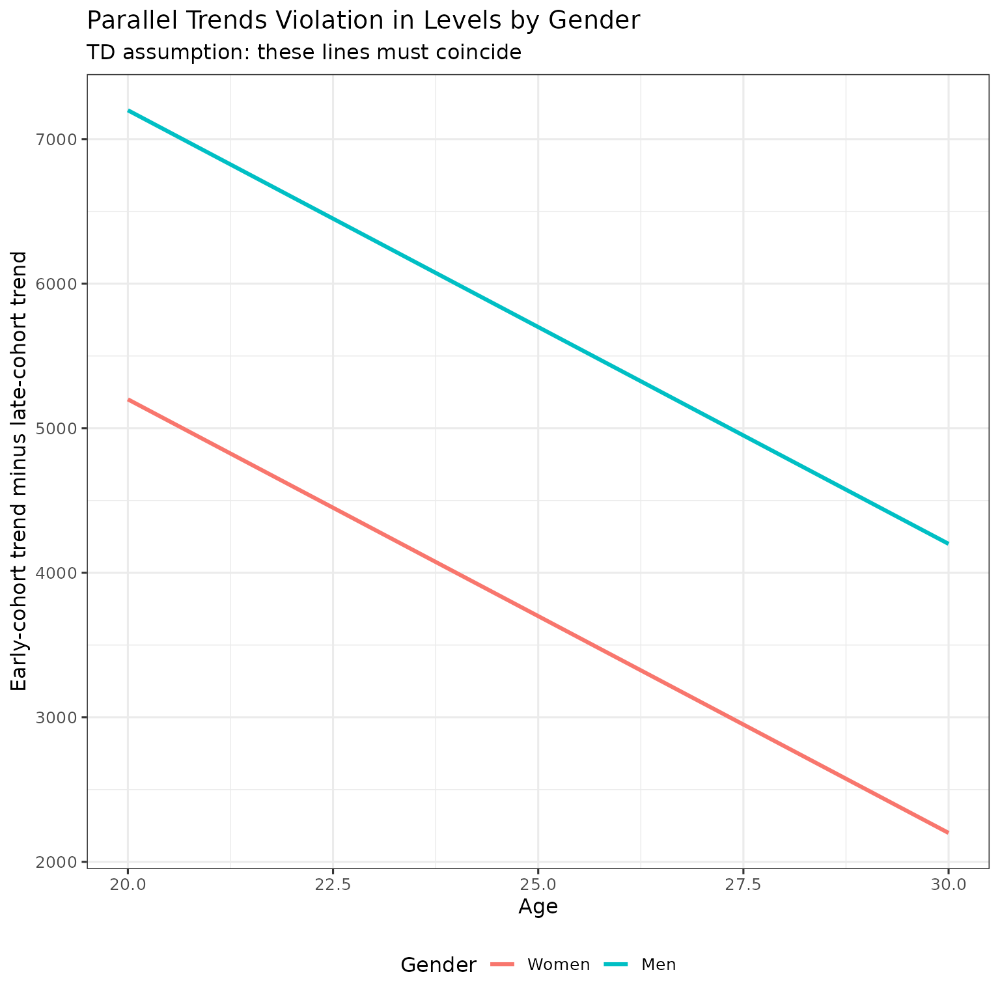
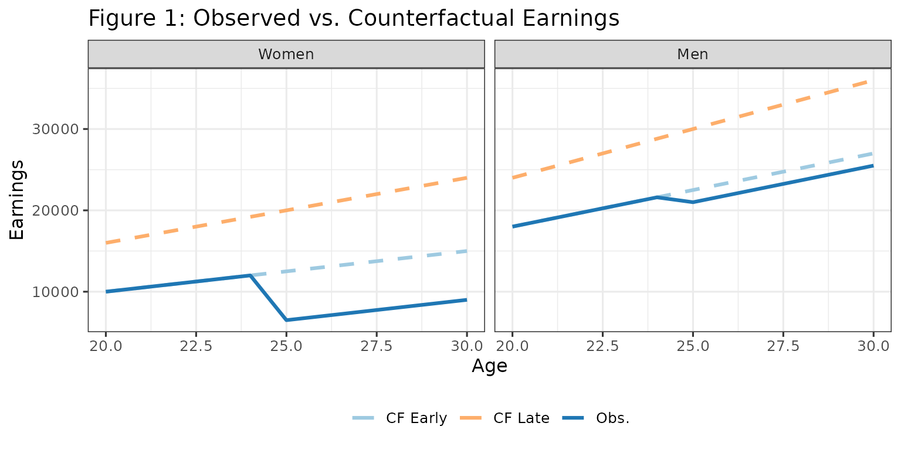
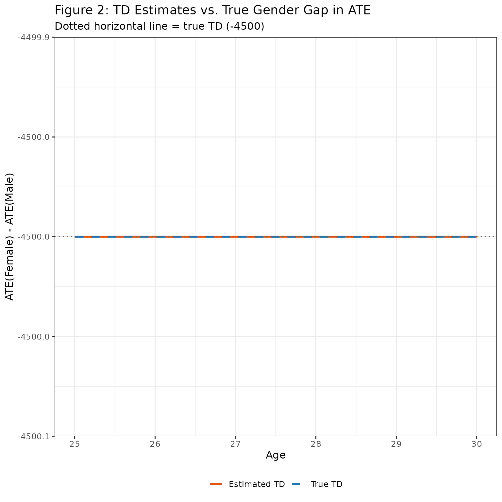
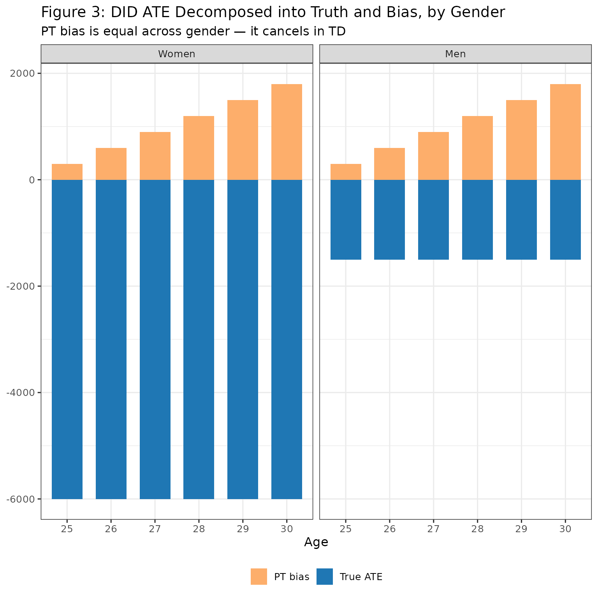
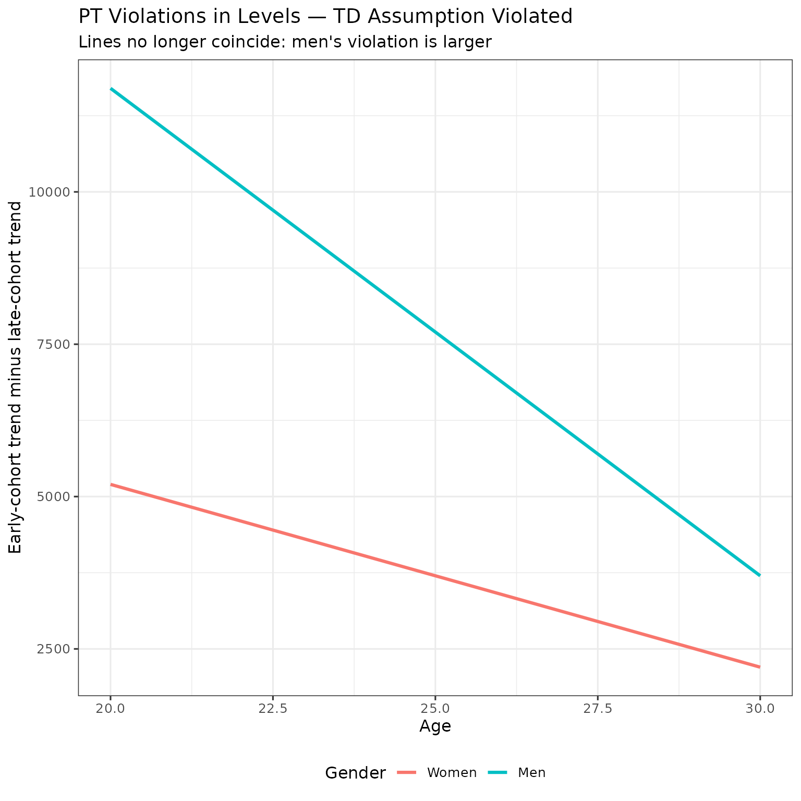
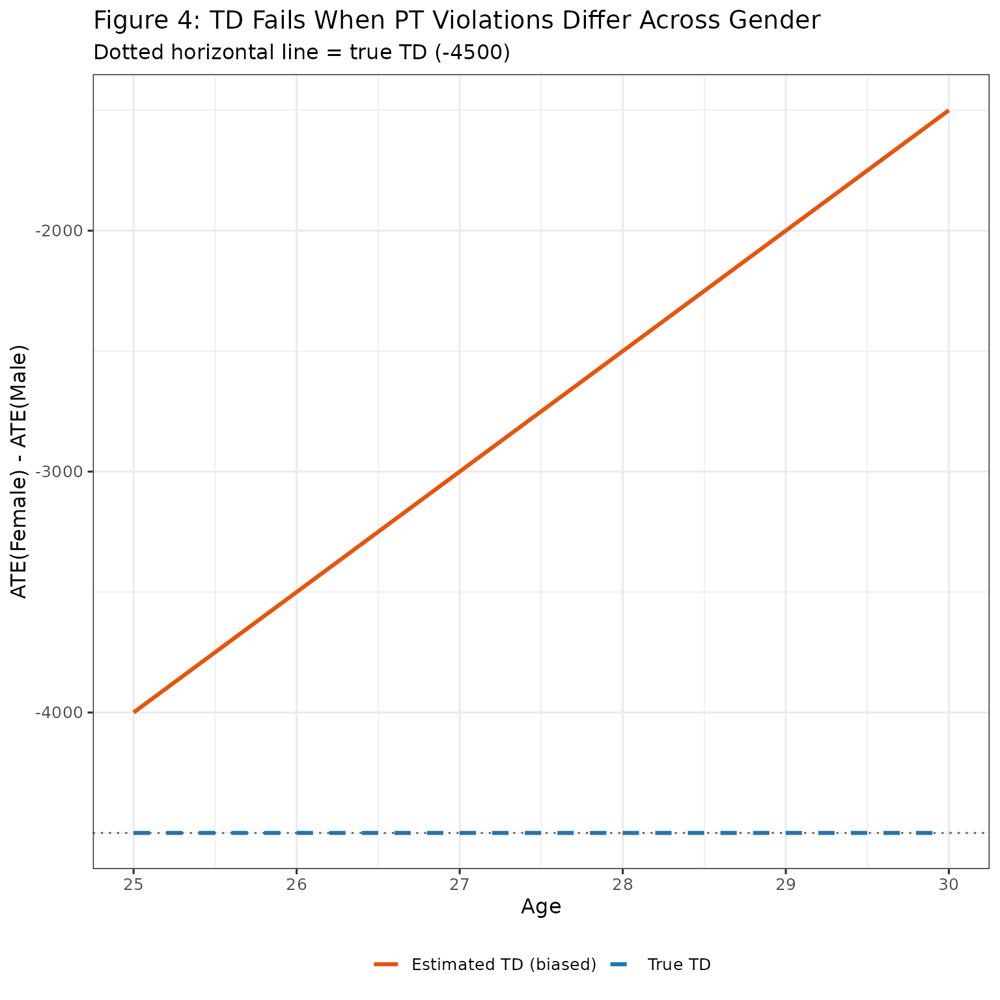

# TD-identification

> **Notation.** For symbol definitions, see the [notation
> vignette](https://dorleventer.github.io/childpen/articles/notation.md).

> **Note.** This vignette uses a stylised DGP to illustrate the TD
> identification assumption. Treatment effects are chosen for clarity,
> not calibrated to empirical magnitudes.

## Overview

The aim of this vignette is to create intuition on the triple
differences (TD) identification framework and its identifying
assumption.

TD estimates the **gender gap in treatment effects in levels**:

``` math
\text{TD} = \text{ATE}(\text{Female}) - \text{ATE}(\text{Male})
```

Like DID, TD relies on a parallel trends assumption — but a stronger
one. Where DID assumes no cohort-level trend difference within each
gender, TD allows such violations but requires them to be **equal across
genders in levels**. Formally, the PT violation for gender $`g`$ and
cohort comparison $`(d, d')`$ is:

``` math
\gamma_{\text{PT}}(g) = \left[Y_0(a, g, d') - Y_0(d-1, g, d')\right] - \left[Y_0(a, g, d) - Y_0(d-1, g, d)\right]
```

where $`Y_0(a,g,d)`$ is the counterfactual earnings (potential outcome
under no treatment, $`Y_a(\infty)`$ in our notation).

The TD identifying assumption is:
$`\gamma_{\text{PT}}(\text{female}) = \gamma_{\text{PT}}(\text{male})`$.

**This vignette demonstrates:**

1.  The TD identifying assumption and when it holds
2.  How TD recovers the true gender gap in ATE when the assumption holds
3.  What goes wrong when the assumption fails
4.  Why NTD_Conv’s assumption is weaker than TD’s

We’ll use a simple DGP to visualize everything. You are encouraged to
play with the code to see how results change under different parameters.

------------------------------------------------------------------------

## The DGP

We create a DGP with:

- Two genders: women and men
- Two treatment cohorts: early ($`D=25`$) and late ($`D=30`$)
- Linear earnings growth, with late cohorts having steeper slopes than
  early cohorts
- **Crucially:** the slope difference between cohorts is the same in
  levels for men and women — so PT violations are equal across gender

The key design choice: the steeper slope for the late cohort is an
**additive** increment that is the same for both genders. This means the
PT violation in levels is identical for men and women, satisfying the TD
assumption.

``` r

# Parameters
baseline        <- 500
slope_extra     <- 300   # additive slope bonus for late cohort (same for both genders)
slope_m_bonus   <- 400   # men earn more (shifts level, not slope structure)
ages            <- 20:30
d_early         <- 25
d_late          <- 30

# Counterfactual earning slopes (earnings = slope * age)
s_f_early <- baseline
s_f_late  <- baseline + slope_extra
s_m_early <- baseline + slope_m_bonus
s_m_late  <- baseline + slope_m_bonus + slope_extra   # same additive increment

# Treatment effects (ATE)
ate_f  <- -6000
ate_m  <- -1500

true_td <- ate_f - ate_m   # gender gap in levels: the estimand of interest

# Build each group
make_group <- function(sex, D, slope, ate_level) {
  tibble(
    age    = ages,
    female = sex,
    D      = D,
    y_0    = slope * age,
    y_1    = y_0 + ifelse(age >= D, ate_level, 0),
    y      = y_1
  )
}

data <- bind_rows(
  make_group(1, d_early, s_f_early, ate_f),
  make_group(1, d_late,  s_f_late,  ate_f),
  make_group(0, d_early, s_m_early, ate_m),
  make_group(0, d_late,  s_m_late,  ate_m)
)
```

The true TD (gender gap in ATE) is -4500.

------------------------------------------------------------------------

## Verifying the TD Assumption Holds

The TD assumption requires that parallel trends violations in **levels**
are equal across genders. Let’s verify this in our DGP.

### Parallel trends violation in levels

The PT violation compares the trend from the pre-treatment age to each
subsequent age, separately for the early and late cohort, within each
gender:

``` r

# Trend: change in counterfactual from age (D-1) to each age, within cohort
trend <- function(g, d, a) {
  pre  <- data |> filter(D == d, female == g, age == d - 1) |> pull(y_0)
  post <- data |> filter(D == d, female == g, age == a)     |> pull(y_0)
  post - pre
}

# PT violation: early-cohort trend minus late-cohort trend, by gender
pt_violation <- function(g, a) trend(g, d_early, a) - trend(g, d_late, a)

expand_grid(female = c(0, 1), age = ages) |>
  mutate(
    pt_viol = mapply(pt_violation, female, age),
    gender  = factor(if_else(female == 1, "Women", "Men"), levels = c("Women", "Men"))
  ) |>
  ggplot(aes(x = age, y = pt_viol, color = gender)) +
  geom_line(linewidth = 1.1) +
  labs(
    title = "Parallel Trends Violation in Levels by Gender",
    subtitle = "TD assumption: these lines must coincide",
    x = "Age",
    y = "Early-cohort trend minus late-cohort trend",
    color = "Gender"
  ) +
  theme(legend.position = "bottom")
```



**Takeaway:** The PT violations in levels are **identical** for men and
women at every age. This is exactly what the TD identifying assumption
requires. By construction, the late-cohort slope bonus (`slope_extra`)
is the same additive amount for both genders, so the trend difference
cancels equally.

------------------------------------------------------------------------

## When TD Works — Recovering the True Gender Gap

Now let’s show that TD recovers the true gender gap in ATE under this
DGP.

### Step 1: The observed and counterfactual earnings

``` r

plot_df <- bind_rows(
  data |>
    filter(D == d_early) |>
    pivot_longer(cols = c(y_0, y), names_to = "series", values_to = "value"),
  data |>
    filter(D == d_late) |>
    transmute(age, female, D, series = "y_0", value = y_0)
) |>
  mutate(
    gender = factor(if_else(female == 1, "Women", "Men"), levels = c("Women", "Men")),
    cohort = factor(if_else(D == d_early, "Early (D=25)", "Late (D=30)"),
                    levels = c("Early (D=25)", "Late (D=30)")),
    series_label = case_when(
      cohort == "Early (D=25)" & series == "y"   ~ "Early — Observed",
      cohort == "Early (D=25)" & series == "y_0" ~ "Early — Counterfactual",
      cohort == "Late (D=30)"  & series == "y_0" ~ "Late — Counterfactual"
    ),
    linetype = if_else(series_label == "Early — Observed", "solid", "dashed"),
    color = case_when(
      series_label == "Early — Observed"       ~ "Obs.",
      series_label == "Early — Counterfactual" ~ "CF Early",
      TRUE                                     ~ "CF Late"
    )
  )

ggplot(plot_df, aes(x = age, y = value, group = series_label)) +
  geom_line(aes(linetype = linetype, color = color), linewidth = 1.1) +
  facet_wrap(~gender, nrow = 1) +
  scale_linetype_identity() +
  scale_color_manual(
    values = c("Obs." = "#1f77b4", "CF Early" = "#9ecae1", "CF Late" = "#fdae6b")
  ) +
  labs(
    title = "Figure 1: Observed vs. Counterfactual Earnings",
    x = "Age", y = "Earnings", color = NULL
  ) +
  theme(legend.position = "bottom")
```



- Solid blue: observed earnings for the early cohort after treatment at
  age 25
- Light blue dashed: true counterfactual for the early cohort
- Orange dashed: counterfactual for the late cohort (our control group)

### Step 2: Compute the DID APO and ATE for each gender

TD uses the same DID machinery within each gender — it then differences
the two ATE estimates:

``` r

# DID-imputed counterfactual for early cohort, by gender
did_cf <- bind_rows(lapply(c(1, 0), function(g) {
  early_pre <- data |> filter(female == g, D == d_early, age == d_early - 1) |> pull(y)
  late_cf   <- data |> filter(female == g, D == d_late)  |> select(age, y_0)
  late_pre  <- late_cf |> filter(age == d_early - 1) |> pull(y_0)

  tibble(
    age    = late_cf$age,
    female = g,
    APO_did = early_pre + (late_cf$y_0 - late_pre)
  )
}))

results <- data |>
  filter(D == d_early) |>
  select(age, female, y_0, y) |>
  left_join(did_cf, by = c("age", "female")) |>
  mutate(
    ATE_true = y   - y_0,
    ATE_did  = y   - APO_did,
    PT_bias  = APO_did - y_0,
    gender   = factor(if_else(female == 1, "Women", "Men"), levels = c("Women", "Men"))
  )
```

### Step 3: Compute TD

TD differences the ATE estimates across gender:

``` r

td_estimates <- results |>
  filter(age >= d_early) |>
  group_by(age) |>
  summarise(
    TD_true = ATE_true[female == 1] - ATE_true[female == 0],
    TD_est  = ATE_did[female == 1]  - ATE_did[female == 0],
    .groups = "drop"
  )

td_estimates |>
  pivot_longer(c(TD_true, TD_est), names_to = "series", values_to = "value") |>
  mutate(series = if_else(series == "TD_true", "True TD", "Estimated TD")) |>
  ggplot(aes(x = age, y = value, color = series, linetype = series)) +
  geom_line(linewidth = 1.1) +
  geom_hline(yintercept = true_td, linetype = "dotted", color = "gray40") +
  scale_color_manual(values = c("True TD" = "#1f77b4", "Estimated TD" = "#e6550d")) +
  scale_linetype_manual(values = c("True TD" = "dashed", "Estimated TD" = "solid")) +
  labs(
    title = "Figure 2: TD Estimates vs. True Gender Gap in ATE",
    subtitle = paste0("Dotted horizontal line = true TD (", true_td, ")"),
    x = "Age", y = "ATE(Female) - ATE(Male)", color = NULL, linetype = NULL
  ) +
  theme(legend.position = "bottom")
```



**Takeaway:** TD recovers the true gender gap exactly. The PT bias that
inflates each gender’s ATE is identical across genders, so it cancels
when we take the difference:

``` math
\widehat{\text{TD}} = \underbrace{(\text{True ATE}_f - \text{PT Bias}_f)}_{\text{DID ATE}_f} - \underbrace{(\text{True ATE}_m - \text{PT Bias}_m)}_{\text{DID ATE}_m} = \text{True ATE}_f - \text{True ATE}_m
```

because $`\text{PT Bias}_f = \text{PT Bias}_m`$ under the TD assumption.

### Decomposition by gender

Let’s confirm the cancellation visually:

``` r

results |>
  filter(age >= d_early) |>
  select(age, gender, ATE_true, ATE_did, PT_bias) |>
  pivot_longer(c(ATE_true, PT_bias), names_to = "component", values_to = "value") |>
  mutate(component = if_else(component == "ATE_true", "True ATE", "PT bias")) |>
  ggplot(aes(x = factor(age), y = value, fill = component)) +
  geom_col(width = 0.7) +
  facet_wrap(~gender, nrow = 1) +
  scale_fill_manual(values = c("True ATE" = "#1f77b4", "PT bias" = "#fdae6b")) +
  labs(
    title = "Figure 3: DID ATE Decomposed into Truth and Bias, by Gender",
    subtitle = "PT bias is equal across gender — it cancels in TD",
    x = "Age", y = NULL, fill = NULL
  ) +
  theme(legend.position = "bottom")
```



The orange bars (PT bias) are the same height for men and women at every
age. When we difference the columns across gender, the orange cancels
and only the blue (true ATE gap) remains.

------------------------------------------------------------------------

## When TD Fails — Unequal PT Violations

Now let’s modify the DGP so that the PT violations differ across gender.
We give men a larger late-cohort slope bonus than women:

``` r

# New parameters: men get a bigger late-cohort slope bonus
slope_extra_f_fail <- 300   # unchanged for women
slope_extra_m_fail <- 800   # larger for men — breaks TD assumption

s_f_early_fail <- baseline
s_f_late_fail  <- baseline + slope_extra_f_fail
s_m_early_fail <- baseline + slope_m_bonus
s_m_late_fail  <- baseline + slope_m_bonus + slope_extra_m_fail   # asymmetric

data_fail <- bind_rows(
  make_group(1, d_early, s_f_early_fail, ate_f),
  make_group(1, d_late,  s_f_late_fail,  ate_f),
  make_group(0, d_early, s_m_early_fail, ate_m),
  make_group(0, d_late,  s_m_late_fail,  ate_m)
)
```

### Verify the TD assumption now fails

``` r

trend_fail <- function(g, d, a) {
  pre  <- data_fail |> filter(D == d, female == g, age == d - 1) |> pull(y_0)
  post <- data_fail |> filter(D == d, female == g, age == a)     |> pull(y_0)
  post - pre
}

pt_violation_fail <- function(g, a) trend_fail(g, d_early, a) - trend_fail(g, d_late, a)

expand_grid(female = c(0, 1), age = ages) |>
  mutate(
    pt_viol = mapply(pt_violation_fail, female, age),
    gender  = factor(if_else(female == 1, "Women", "Men"), levels = c("Women", "Men"))
  ) |>
  ggplot(aes(x = age, y = pt_viol, color = gender)) +
  geom_line(linewidth = 1.1) +
  labs(
    title = "PT Violations in Levels — TD Assumption Violated",
    subtitle = "Lines no longer coincide: men's violation is larger",
    x = "Age",
    y = "Early-cohort trend minus late-cohort trend",
    color = "Gender"
  ) +
  theme(legend.position = "bottom")
```



The PT violations are now different in levels across gender. Men’s
violation is larger because they received a bigger late-cohort slope
bonus.

### TD bias under the broken assumption

``` r

did_cf_fail <- bind_rows(lapply(c(1, 0), function(g) {
  early_pre <- data_fail |> filter(female == g, D == d_early, age == d_early - 1) |> pull(y)
  late_cf   <- data_fail |> filter(female == g, D == d_late)  |> select(age, y_0)
  late_pre  <- late_cf |> filter(age == d_early - 1) |> pull(y_0)

  tibble(
    age    = late_cf$age,
    female = g,
    APO_did = early_pre + (late_cf$y_0 - late_pre)
  )
}))

results_fail <- data_fail |>
  filter(D == d_early) |>
  select(age, female, y_0, y) |>
  left_join(did_cf_fail, by = c("age", "female")) |>
  mutate(
    ATE_true = y   - y_0,
    ATE_did  = y   - APO_did,
    PT_bias  = APO_did - y_0,
    gender   = factor(if_else(female == 1, "Women", "Men"), levels = c("Women", "Men"))
  )

td_fail <- results_fail |>
  filter(age >= d_early) |>
  group_by(age) |>
  summarise(
    TD_true = ATE_true[female == 1] - ATE_true[female == 0],
    TD_est  = ATE_did[female == 1]  - ATE_did[female == 0],
    TD_bias = TD_est - TD_true,
    .groups = "drop"
  )

td_fail |>
  pivot_longer(c(TD_true, TD_est), names_to = "series", values_to = "value") |>
  mutate(series = if_else(series == "TD_true", "True TD", "Estimated TD (biased)")) |>
  ggplot(aes(x = age, y = value, color = series, linetype = series)) +
  geom_line(linewidth = 1.1) +
  geom_hline(yintercept = true_td, linetype = "dotted", color = "gray40") +
  scale_color_manual(
    values = c("True TD" = "#1f77b4", "Estimated TD (biased)" = "#e6550d")
  ) +
  scale_linetype_manual(
    values = c("True TD" = "dashed", "Estimated TD (biased)" = "solid")
  ) +
  labs(
    title = "Figure 4: TD Fails When PT Violations Differ Across Gender",
    subtitle = paste0("Dotted horizontal line = true TD (", true_td, ")"),
    x = "Age", y = "ATE(Female) - ATE(Male)", color = NULL, linetype = NULL
  ) +
  theme(legend.position = "bottom")
```



**Takeaway:** When men’s PT violation is larger than women’s, TD
overestimates (in absolute value) the gender gap — the excess violation
for men bleeds through into the TD estimate. The residual bias equals
$`\gamma_{\text{PT}}(\text{female}) - \gamma_{\text{PT}}(\text{male})`$.

Let’s confirm by examining the bias directly:

``` r

td_fail |>
  filter(age >= d_early) |>
  select(age, TD_true, TD_est, TD_bias) |>
  knitr::kable(digits = 0, caption = "TD estimates, truth, and bias by age (broken DGP)")
```

| age | TD_true | TD_est | TD_bias |
|----:|--------:|-------:|--------:|
|  25 |   -4500 |  -4000 |     500 |
|  26 |   -4500 |  -3500 |    1000 |
|  27 |   -4500 |  -3000 |    1500 |
|  28 |   -4500 |  -2500 |    2000 |
|  29 |   -4500 |  -2000 |    2500 |
|  30 |   -4500 |  -1500 |    3000 |

TD estimates, truth, and bias by age (broken DGP) {.table}

The bias is constant across post-treatment ages (it depends only on the
slope difference, which is linear in age relative to the pre-period
anchor).

------------------------------------------------------------------------

## Connection to NTD_Conv

NTD_Conv’s identifying assumption is **weaker** than TD’s. NTD_Conv
requires only that the *normalized* PT violations are equal across
gender:

``` math
\frac{\gamma_{\text{PT}}(\text{female})}{\text{APO}(\text{female})} = \frac{\gamma_{\text{PT}}(\text{male})}{\text{APO}(\text{male})}
```

This allows the levels violations to differ across gender — as long as
the differences are proportional to each gender’s earnings level. In the
broken DGP above, if men’s larger slope bonus were exactly proportional
to their higher earnings, NTD_Conv would still be valid while TD would
fail.

In short:

| Assumption | What it requires                                        |
|------------|---------------------------------------------------------|
| DID        | No PT violation within any gender                       |
| **TD**     | PT violations in levels are equal across gender         |
| NTD_Conv   | PT violations normalized by APO are equal across gender |

NTD_Conv is the most permissive of the three. See the
`NTD-identification` vignette for a detailed walkthrough of NTD_Conv and
the multiplicative bias that arises from normalization.
