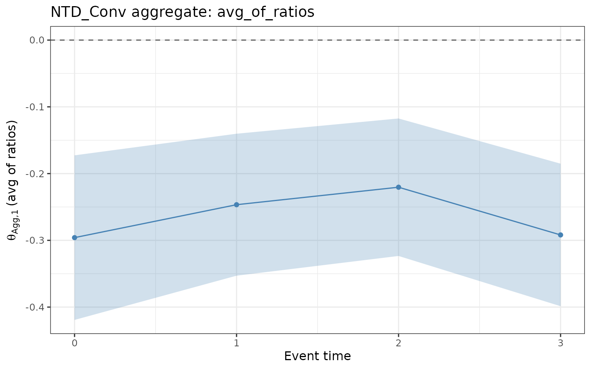
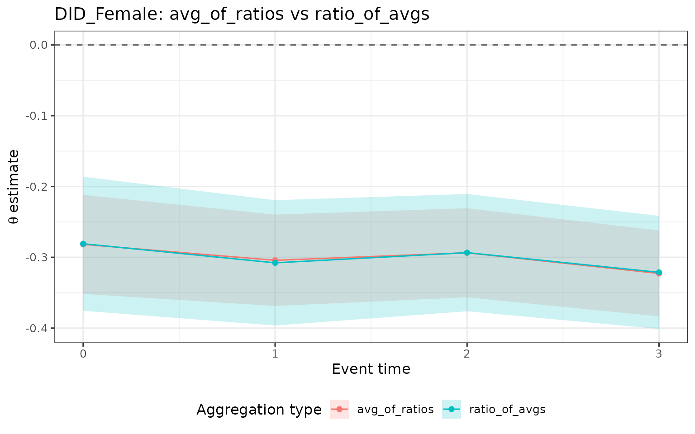
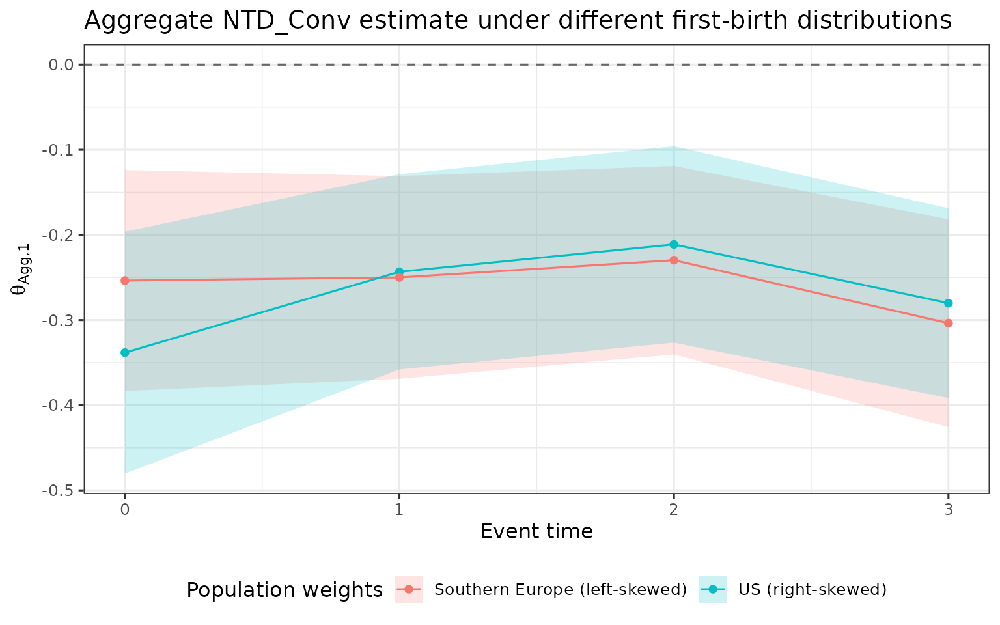
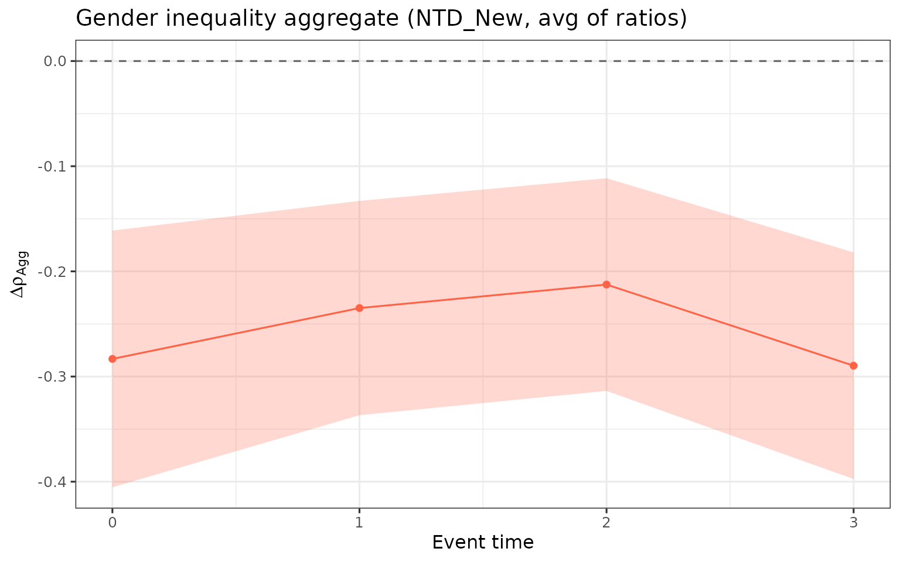

# aggregate-estimands

> **Notation.** For symbol definitions, see the [notation
> vignette](https://dorleventer.github.io/childpen/articles/notation.md).

## Overview

[`multiple_treatment_group_analysis()`](https://dorleventer.github.io/childpen/reference/multiple_treatment_group_analysis.md)
estimates child-penalty effects separately for each treatment group
$`d`$ (age at first birth). Because groups differ in their baseline
earnings, age composition, and selection, a single group’s estimate is
not directly comparable to another’s.
[`aggregate_estimands()`](https://dorleventer.github.io/childpen/reference/aggregate_estimands.md)
collapses the group-specific estimates into a single number per event
time, answering the question: *what is the average effect across the
distribution of first-birth ages?*

Three aggregate estimands are available:

- **avg_of_ratios** ($`\theta_{\text{Agg},1}`$): weighted average of
  each group’s normalized effect $`\theta(g,d,d+e)`$. Formally,
  $`\theta_{\text{Agg},1}(g,e) = \sum_d w_d \cdot \theta(g,d,d+e)`$,
  where $`w_d`$ are population weights normalised to sum to one.
  Preferred because normalization happens within each group before
  aggregation, so baseline differences do not inflate the average.
- **ratio_of_avgs** ($`\theta_{\text{Agg},2}`$): ratio of the
  weighted-average ATE to the weighted-average APO. Formally,
  $`\theta_{\text{Agg},2}(g,e) = \sum_d w_d \cdot \text{ATE}(g,d,d+e) \;/\; \sum_d w_d \cdot \text{APO}(g,d,d+e)`$.
  This implicitly up-weights high-earning groups (their larger APO
  contributes proportionally more to the pooled denominator), so it
  differs from $`\theta_{\text{Agg},1}`$ when earnings vary across
  groups.
- **gender_ineq** ($`\Delta\rho_{\text{Agg}}`$): weighted average of
  `NTD_New` $`\Delta\rho`$ estimates — the aggregate gender-inequality
  penalty. Formally,
  $`\Delta\rho_{\text{Agg}}(e) = \sum_d w_d \cdot \Delta\rho(d,d+e)`$.

## Simulate data

``` r

library(childpen)

set.seed(42)
data <- simulate_data(n_individuals = 2000, treatment_groups = 25:32)
head(data)
#>   id female age  D  Y_inf      Y
#> 1  1      1  20 25  32193  32193
#> 2  1      1  21 25  46159  46159
#> 3  1      1  22 25  79432  79432
#> 4  1      1  23 25  75703  75703
#> 5  1      1  24 25 291366 291366
#> 6  1      1  25 25 139286  94345
```

## Run estimation

We estimate all methods for treatment groups 25–28 with three
post-treatment periods.

``` r

res <- multiple_treatment_group_analysis(
  data             = data,
  treatment_groups = 25:28,
  periods_post     = 3,
  periods_pre      = NULL,
  verbose          = FALSE
)
```

## Basic aggregation

Calling
[`aggregate_estimands()`](https://dorleventer.github.io/childpen/reference/aggregate_estimands.md)
with default arguments applies uniform weights across whichever
treatment groups contribute an estimate to each event-time cell.

``` r

agg <- aggregate_estimands(res)
head(agg)
#>   event_time estimand     method      agg_type       est       se n_groups
#> 1          0    theta DID_Female avg_of_ratios -0.281741 0.035683        4
#> 2          1    theta DID_Female avg_of_ratios -0.304234 0.032906        4
#> 3          2    theta DID_Female avg_of_ratios -0.293613 0.032100        4
#> 4          3    theta DID_Female avg_of_ratios -0.322766 0.030963        4
#> 5          0    theta   DID_Male avg_of_ratios  0.014189 0.051801        4
#> 6          1    theta   DID_Male avg_of_ratios -0.057632 0.043137        4
#>        ci_l      ci_h
#> 1 -0.351680 -0.211803
#> 2 -0.368730 -0.239737
#> 3 -0.356529 -0.230698
#> 4 -0.383453 -0.262078
#> 5 -0.087341  0.115719
#> 6 -0.142181  0.026917
```

The output has one row per `event_time × estimand × method × agg_type`
combination. The `n_groups` column records how many treatment groups
contributed — useful for spotting cells where edge-of-sample groups drop
out due to `max_age`/`min_age` bounds.

## Plot aggregate results

Plot the `avg_of_ratios` aggregate for the `NTD_Conv` method across
event times, with 95% confidence ribbons.

``` r

agg |>
  filter(agg_type == "avg_of_ratios", method == "NTD_Conv", estimand == "theta") |>
  ggplot(aes(x = event_time, y = est, ymin = ci_l, ymax = ci_h)) +
  geom_ribbon(fill = "steelblue", alpha = 0.25, color = NA) +
  geom_line(color = "steelblue") +
  geom_point(color = "steelblue") +
  geom_hline(yintercept = 0, linetype = "dashed", color = "grey40") +
  labs(
    x     = "Event time",
    y     = expression(theta[Agg * "," * 1] ~ "(avg of ratios)"),
    title = "NTD_Conv aggregate: avg_of_ratios"
  )
```



## Compare aggregation types

`avg_of_ratios` and `ratio_of_avgs` answer the same underlying question
but weight groups differently. When high first-birth-age groups have
higher counterfactual earnings than low first-birth-age groups,
`ratio_of_avgs` assigns them more weight (the APO enters the denominator
for each group before the ratio is formed across groups). The two
estimands therefore diverge whenever earnings are heterogeneous across
groups.

``` r

agg |>
  filter(
    agg_type %in% c("avg_of_ratios", "ratio_of_avgs"),
    method   == "DID_Female",
    estimand == "theta"
  ) |>
  ggplot(aes(
    x     = event_time,
    y     = est,
    ymin  = ci_l,
    ymax  = ci_h,
    color = agg_type,
    fill  = agg_type
  )) +
  geom_ribbon(alpha = 0.2, color = NA) +
  geom_line() +
  geom_point() +
  geom_hline(yintercept = 0, linetype = "dashed", color = "grey40") +
  labs(
    x     = "Event time",
    y     = expression(theta ~ "estimate"),
    title = "DID_Female: avg_of_ratios vs ratio_of_avgs",
    color = "Aggregation type",
    fill  = "Aggregation type"
  ) +
  theme(legend.position = "bottom")
```



If the two lines are similar, earnings are approximately homogeneous
across groups. Divergence is a sign that the treatment-group
distribution interacts with baseline earnings levels, and the researcher
must decide which weighting regime is more policy-relevant.

## Custom weights

By default all treatment groups receive equal weight. Researchers often
want to weight groups by their empirical share in a target population.
Below we contrast two stylized distributions:

- **Right-skewed** (mimicking the US): most first births concentrate at
  younger ages.
- **Left-skewed** (mimicking Southern Europe): most first births
  concentrate at older ages.

``` r

groups <- as.character(25:28)

# Right-skewed: more weight on younger groups
w_us <- setNames(c(0.40, 0.30, 0.20, 0.10), groups)

# Left-skewed: more weight on older groups
w_se <- setNames(c(0.10, 0.20, 0.30, 0.40), groups)

agg_us <- aggregate_estimands(res, weights = w_us)
agg_se <- aggregate_estimands(res, weights = w_se)

bind_rows(
  mutate(agg_us, population = "US (right-skewed)"),
  mutate(agg_se, population = "Southern Europe (left-skewed)")
) |>
  filter(
    agg_type == "avg_of_ratios",
    method   == "NTD_Conv",
    estimand == "theta"
  ) |>
  ggplot(aes(
    x     = event_time,
    y     = est,
    ymin  = ci_l,
    ymax  = ci_h,
    color = population,
    fill  = population
  )) +
  geom_ribbon(alpha = 0.2, color = NA) +
  geom_line() +
  geom_point() +
  geom_hline(yintercept = 0, linetype = "dashed", color = "grey40") +
  labs(
    x     = "Event time",
    y     = expression(theta[Agg * "," * 1]),
    title = "Aggregate NTD_Conv estimate under different first-birth distributions",
    color = "Population weights",
    fill  = "Population weights"
  ) +
  theme(legend.position = "bottom")
```



When younger groups bear larger penalties than older groups (or vice
versa), the choice of weight vector shifts the aggregate estimate.
Reporting both provides a sensitivity check on how much the aggregate
depends on the first-birth distribution.

## Gender inequality aggregate

The `gender_ineq` aggregate ($`\Delta\rho_{\text{Agg}}`$) is the
weighted average of `NTD_New` $`\Delta\rho`$ estimates across treatment
groups. It measures how parenthood affects the female-to-male earnings
ratio: negative values indicate that mothers bear a larger proportional
penalty — the female-to-male earnings ratio is lower post-birth than the
counterfactual ratio.

``` r

agg |>
  filter(agg_type == "gender_ineq", estimand == "Delta_rho", method == "NTD_New") |>
  ggplot(aes(x = event_time, y = est, ymin = ci_l, ymax = ci_h)) +
  geom_ribbon(fill = "tomato", alpha = 0.25, color = NA) +
  geom_line(color = "tomato") +
  geom_point(color = "tomato") +
  geom_hline(yintercept = 0, linetype = "dashed", color = "grey40") +
  labs(
    x     = "Event time",
    y     = expression(Delta * rho[Agg]),
    title = "Gender inequality aggregate (NTD_New, avg of ratios)"
  )
```



A flat, negative profile indicates a persistent parenthood-driven gender
gap; values closer to zero at later event times suggest the gap narrows
as parents age away from the birth event.
