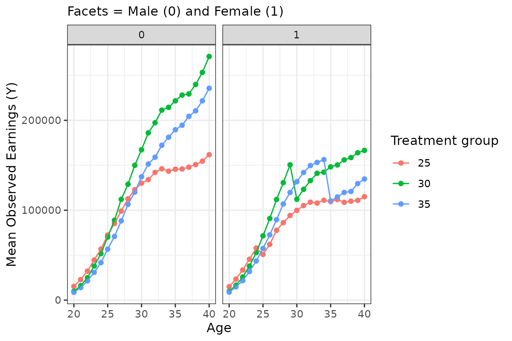
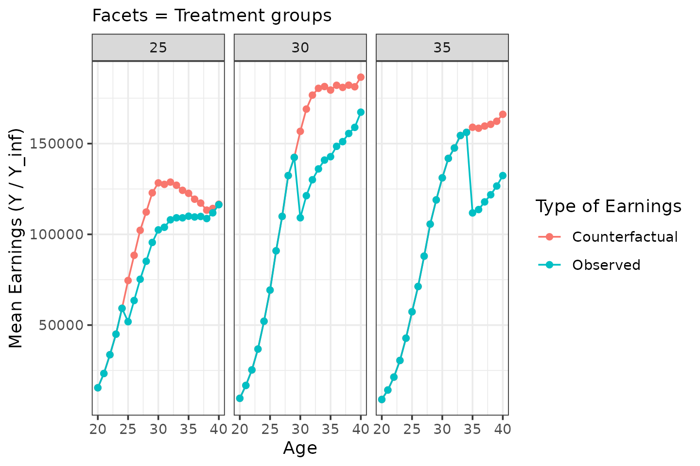
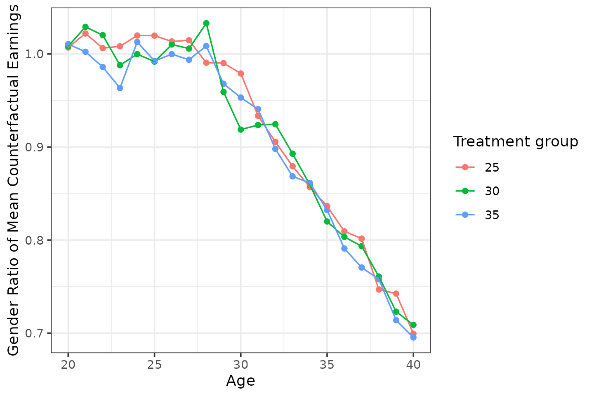

# simulation

## Simulating Data with `childpen`

The `childpen` package includes a simulation engine designed to
reproduce stylized patterns from the child-penalty literature—diverging
earnings paths for women and men after the arrival of a first child.

This vignette shows how to generate data, and some stylistic facts on
the DGP.

------------------------------------------------------------------------

### Basic usage

Draw data using the `simulate_data` function.

``` r

library(childpen)

N <- 100000
sim_data <- simulate_data(n_individuals = N)
head(sim_data)
#>   id female age  D  Y_inf      Y
#> 1  1      1  20 25  17173  17173
#> 2  1      1  21 25  14355  14355
#> 3  1      1  22 25  14666  14666
#> 4  1      1  23 25  63052  63052
#> 5  1      1  24 25 137095 137095
#> 6  1      1  25 25 110479 112114
```

The `id` column is the individual id. `female` is binary indicator, = 1
indicates females and = 0 indicates males. `age` indicates the age at
which the earnings are observed. `D` is the treatment variable — age at
first childbirth. `Y_inf` represents $`Y_{i,a}(\infty)`$, that is the
potential earnings under never having a child. `Y` represents observed
earnings, equal to potential earnings under having a child at $`D`$.

#### Notation

Throughout the package vignettes we use the following symbols (see
[Leventer 2025, §2–3](https://arxiv.org/abs/2602.07486) for formal
definitions):

| Symbol | Definition |
|----|----|
| $`G \in \{f,m\}`$ | Gender (female, male) |
| $`D`$ | Age at first childbirth (treatment timing) |
| $`Y_{i,a}(d)`$ | Potential earnings of individual $`i`$ at age $`a`$ if first birth occurs at age $`d`$ |
| $`Y_{i,a}(\infty)`$ | Potential earnings under never having a child |
| $`\text{APO}(g,d,a) = \mathbb{E}[Y_a(\infty) \mid G=g, D=d]`$ | Average counterfactual earnings |
| $`\text{ATE}(g,d,a) = \mathbb{E}[Y_a(d) - Y_a(\infty) \mid G=g, D=d]`$ | Average treatment effect of parenthood |
| $`\theta(g,d,a) = \text{ATE}/\text{APO}`$ | Normalised effect (proportional earnings change) |
| $`\rho(d,a) = \text{APO}(f,d,a) / \text{APO}(m,d,a)`$ | Gender earnings ratio (counterfactual) |
| $`\Delta\rho(d,a)`$ | Effect of parenthood on the gender earnings ratio |

### How was the DGP generated

The DGP is supposed to serve as a realistic DGP for simulations studies
of child penalty applications.

The goal is to construct life-cycle earning profiles for the potential
earnings under the observed treatment and under the counterfactual
treatment of never having a child. The problem is that identifying these
life-cycle patterns for counterfactual earnings is difficult. So the DGP
does some simplifying assumptions, to construct a process which creates
life-cycle earnings, which are motivated by the empirical data.

1.  Using Israeli administrative data, mean earnings for triplets
    (gender, treatment group, age) were estimated.
2.  Mens mean earnings were fit with cubic polynomials.
3.  Assume that men have zero treatment effect. Assign mean
    counterfactual earnings for men using means of observed outcomes.
4.  Assume that womens’ mean counterfactual earnings, within treatment
    group, are equal to men up to age 27. Starting from age 28,
    inequality in counterfactual earnings increases by 0.025 per year.
5.  Assume that the average treatment effect for women is a 30% drop at
    the time of treatment, and that women recover at a rate of 2% per
    year.

### Example moments

Below I produce some graphs to construct intuition on the DGP behind the
simulation.

First, for simplicity, treatment distribution is uniform, and treatment
groups include 25-40.

``` r

sim_data |> 
  filter(age == D, female == 1) |>
  count(D)
#>     D    n
#> 1  25 3140
#> 2  26 3061
#> 3  27 3138
#> 4  28 3138
#> 5  29 3209
#> 6  30 3122
#> 7  31 3138
#> 8  32 3072
#> 9  33 3106
#> 10 34 3194
#> 11 35 3149
#> 12 36 3032
#> 13 37 3231
#> 14 38 3029
#> 15 39 3148
#> 16 40 3093
```

Second, treatment groups generally behave as:

1.  Early treated (e.g., 25) - low selection (low ability / low human
    capital)
2.  Mid treated (e.g. 30) - highest selection
3.  Late treated (e.g. 35) - mid selection

``` r

sim_data |> 
  filter(D %in% c(25, 30, 35)) |> 
  group_by(female, D, age) |> 
  summarize(Y = mean(Y)) |> 
  ggplot(aes(x = age, y = Y, color = factor(D))) + 
  geom_point() + geom_line() +
  facet_wrap(facets = vars(female)) + 
  labs(x = "Age", y = "Mean Observed Earnings (Y)", color = "Treatment group", subtitle = "Facets = Male (0) and Female (1)")
```



For men, zero treatment effect by construct. For women:

``` r

sim_data |> 
  filter(female == 1, 
         D %in% c(25, 30, 35)) |> 
  group_by(female, D, age) |> 
  summarize(Y = mean(Y), Y_inf = mean(Y_inf)) |> 
  ggplot(aes(x = age)) + 
  geom_point(aes(y = Y_inf, color = "Counterfactual")) + geom_line(aes(y = Y_inf, color = "Counterfactual")) +
  geom_point(aes(y = Y, color = "Observed")) + geom_line(aes(y = Y, color = "Observed")) +
  facet_wrap(facets = vars(D)) +
  labs(x = "Age", y = "Mean Earnings (Y / Y_inf)", color = "Type of Earnings", subtitle = "Facets = Treatment groups")
```



By construction, counterfactual gender inequality kicks in from age 28.
The ratio $`\rho`$ is the female-to-male counterfactual earnings ratio.
Values below 1 indicate that women would earn less than men even absent
children.

``` r

sim_data |> 
  filter(D %in% c(25, 30, 35)) |> 
  group_by(female, D, age) |> 
  summarize(Y_inf = mean(Y_inf)) |>
  pivot_wider(names_from = female, values_from = Y_inf, names_glue = "Y_inf_{female}") |> 
  mutate(rho = Y_inf_1 / Y_inf_0) |> 
  ggplot(aes(x = age, y = rho, color = factor(D))) + 
  geom_point() + geom_line()  +
  labs(x = "Age", y = "Gender Ratio of Mean Counterfactual Earnings", color = "Treatment group")
```


