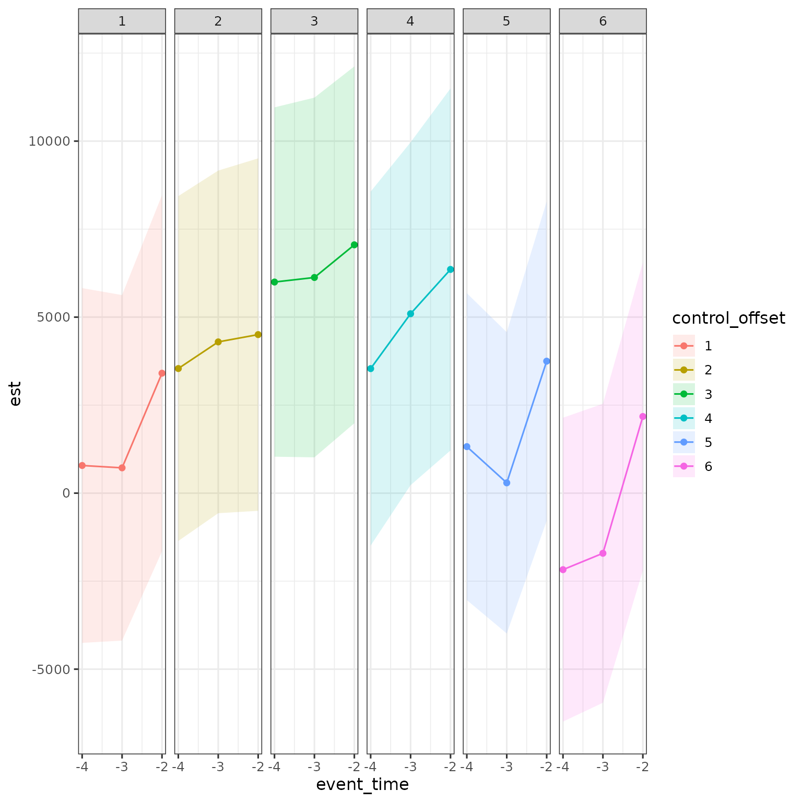
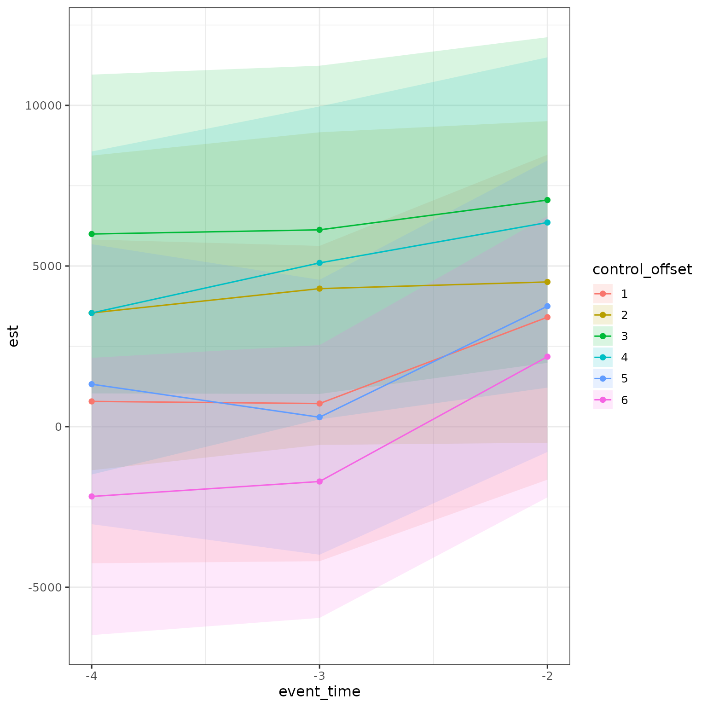
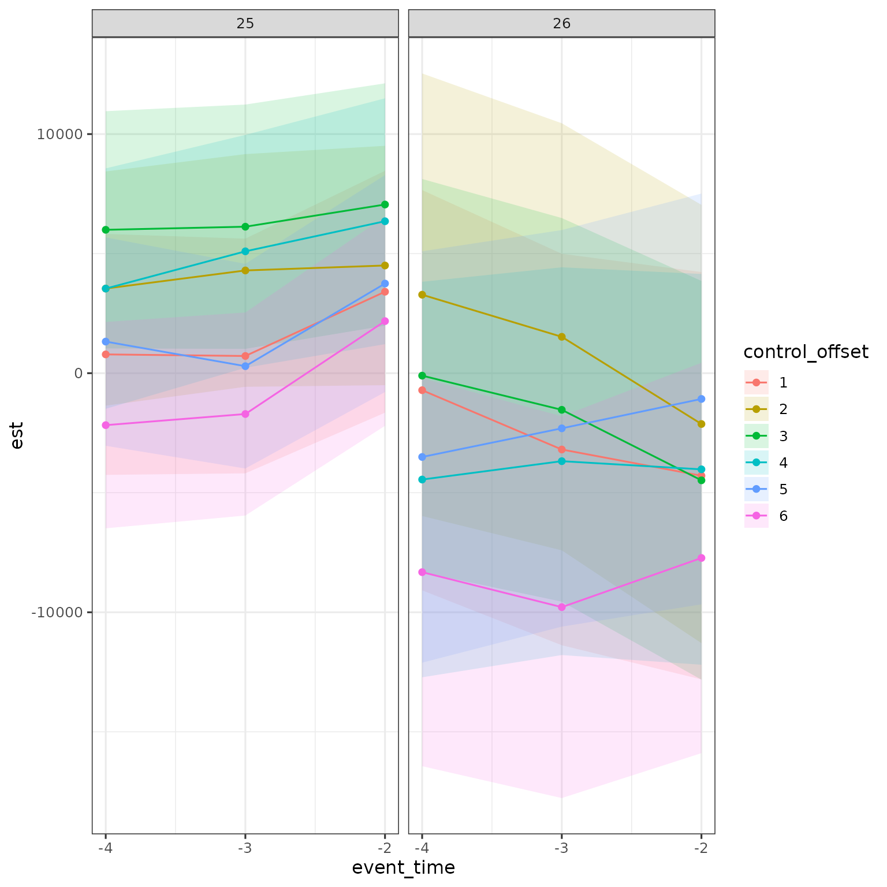
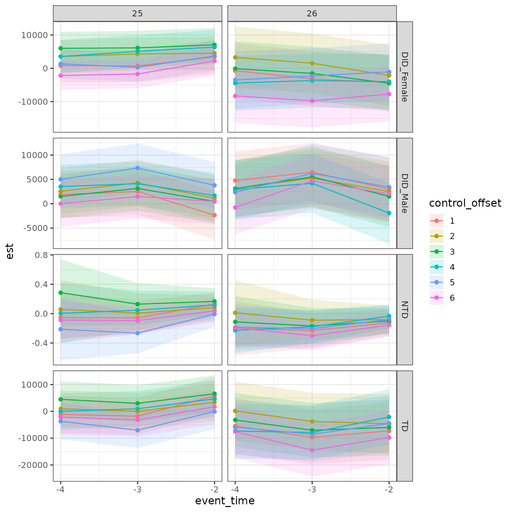

# validation_tests

## Overview

The aim of this vignette is show how to perform correct validation tests
using closest-not-yet-treated control groups using `childpen`.

## Simulate data

The package has a built in simulation function to draw data resembling
child penalty studies.

``` r

library(childpen)

N <- 20000
data <- simulate_data(n_individuals = N)
data |> tibble()
#> # A tibble: 420,000 × 6
#>       id female   age     D   Y_inf       Y
#>    <int>  <int> <int> <int>   <dbl>   <dbl>
#>  1     1      1    20    25  31332.  31332.
#>  2     1      1    21    25  55472.  55472.
#>  3     1      1    22    25  48574.  48574.
#>  4     1      1    23    25  86820.  86820.
#>  5     1      1    24    25  42409.  42409.
#>  6     1      1    25    25 169436. 148877.
#>  7     1      1    26    25 180458. 162171.
#>  8     1      1    27    25 256901. 236005.
#>  9     1      1    28    25 266892. 250521.
#> 10     1      1    29    25 212777. 203981.
#> # ℹ 419,990 more rows
```

## The correct validation tests

See the DID vignette
([link](https://dorleventer.github.io/childpen/articles/DID-estimation.html))
for an explainer on the $`2\times2`$ comparisons in `childpen`. Recall
that $`d`$ is the treatment group, $`a`$ is the target age, and
$`d^\prime=a+1`$ is the closest not-yet-treated control group.

Assume that when presenting results, post-treatment, you report
estimates for event times $`e=0,...,5`$. Then, for each treatment group
$`d`$ you use 6 different control groups in post-treatment estimation.
As the identification assumptions (e.g., parallel trends for DID) must
hold for each point-estimate separately, this implies that it must hold
within each treatment-control pair.

The above argument means that the validation tests should be done
separately by treatment-control combinations. Returning to the above
example, if you want to show results for $`e=0,...,5`$ then you need to
conduct pre-trend analysis for 6 different control groups. This is done
automatically in the `childpen` package, as we show below.

For completeness, the validation tests are:

1.  Difference-in-differences (DID) estimates the average treatment
    effect (ATE) in pre-periods
2.  Triple differences (TD) estimates the gender gap in the ATE in
    pre-preiods
3.  Normalized triple differences (NTD) estimates the gender gap in
    normalized effects in pre-periods

## Multiple treatment group analysis

We will now do the main heavy lifting. We run the main estimation
function,
[`multiple_treatment_group_analysis()`](https://dorleventer.github.io/childpen/reference/multiple_treatment_group_analysis.md).
Set `periods_pre` to the number of pre-treatment periods for which you
want to conduct validation tests. As an example, we will examine three
periods pre-treatment. Since we set the number of periods in the
post-treatment to 5 using `periods_post`, this will report validation
tests separately for 6 control groups, as discussed above.

``` r

res = multiple_treatment_group_analysis(data = data,
                                  treatment_groups = 25:26, # which treatment groups to run in the analysis
                                  periods_post = 5, # estimate results for post periods 0:5
                                  periods_pre = 3, # estimate pre-trend diagnostics, set to NULL to omit from estimation
                                  max_age = 40, # dont estimate results if age is above 40
                                  min_age = 20, # dont estimate results if age is below 20
                                  pre = 1, # use 1 period before treatment, can make further away if anticipation is conern
                                  verbose = FALSE # set to TRUE to output progress (i like to time loops) set to FALSE to omit messages
                                  ) 
```

## Examining results of validation tests

As a first pass, lets see the results.

``` r

res |> tibble()
#> # A tibble: 720 × 16
#>        d    dp     a event_time estimand method             est      se     ci_l
#>    <int> <dbl> <int>      <int> <chr>    <chr>            <dbl>   <dbl>    <dbl>
#>  1    25    26    25          0 APO      DID_Female     7.92e+4 4.02e+3  7.13e+4
#>  2    25    26    25          0 APO      DID_Male       7.27e+4 3.02e+3  6.68e+4
#>  3    25    26    25          0 ATE      DID_Female    -2.85e+4 4.06e+3 -3.65e+4
#>  4    25    26    25          0 ATE      DID_Male       4.01e+2 3.13e+3 -5.74e+3
#>  5    25    26    25          0 theta    DID_Female    -3.61e-1 3.58e-2 -4.31e-1
#>  6    25    26    25          0 theta    DID_Male       5.51e-3 4.33e-2 -7.93e-2
#>  7    25    26    25          0 ATE      TD            -2.89e+4 5.13e+3 -3.90e+4
#>  8    25    26    25          0 theta    NTD           -3.66e-1 5.62e-2 -4.76e-1
#>  9    25    26    25          0 theta    NTD_Alt       -3.96e-1 7.06e-2 -5.35e-1
#> 10    25    26    25          0 APO      TD_Null        7.96e+4 5.10e+3  6.96e+4
#> # ℹ 710 more rows
#> # ℹ 7 more variables: ci_h <dbl>, t <dbl>, p <dbl>, n_female_treat <int>,
#> #   n_female_control <int>, n_male_treat <int>, n_male_control <int>
```

Focusing on $`d=25`$, lets examine pre-trends. We will start with DID of
females. Generally, valid pre-trend validation tests would behave such
that the confidence intervals include 0, and there is no obvious trend
in the pre-period, and there is no systematic difference between control
groups.

Note that in the plot below I define `control_offset` as the difference
between the control group $`d^\prime`$ and the treatment group $`d`$.
E.g., for $`d=25`$ and $`d^\prime=26`$, i.e., the closest
not-yet-treated control group at event time $`e=0`$, I set control
offset to 1.

Ribbons present 95% CI based on standard errors clustered at the
individual level.

``` r

res |> 
  filter(d == 25,
         a < d, 
         estimand == "ATE",
         method == "DID_Female") |> 
  mutate(control_offset = dp - d, 
         control_offset = factor(control_offset)) |> 
  ggplot(aes(x = event_time, y = est, ymin = ci_l, ymax = ci_h, color = control_offset, fill = control_offset)) +
  geom_ribbon(alpha = .15, color = NA) + geom_point() + geom_line() + 
  scale_x_continuous(breaks = -4:-2) + 
  facet_grid(cols = vars(control_offset))
```



Although this would be hard to look at, we can put all control offsets
on same plot.

``` r

res |> 
  filter(d == 25,
         a < d, 
         estimand == "ATE",
         method == "DID_Female") |> 
  mutate(control_offset = dp - d, 
         control_offset = factor(control_offset)) |> 
  ggplot(aes(x = event_time, y = est, ymin = ci_l, ymax = ci_h, color = control_offset, fill = control_offset)) +
  geom_ribbon(alpha = .15, color = NA) + geom_point() + geom_line() + 
  scale_x_continuous(breaks = -4:-2)
```



Can do this for multiple treatment groups at same time

``` r

res |> 
  filter(a < d, 
         estimand == "ATE",
         method == "DID_Female") |> 
  mutate(control_offset = dp - d, 
         control_offset = factor(control_offset)) |> 
  ggplot(aes(x = event_time, y = est, ymin = ci_l, ymax = ci_h, color = control_offset, fill = control_offset)) +
  geom_ribbon(alpha = .15, color = NA) + geom_point() + geom_line() + 
  scale_x_continuous(breaks = -4:-2) + 
  facet_grid(cols = vars(d))
```



Finally, can do this for all methods.

``` r

res |> 
  filter(a < d, 
         estimand == "ATE" & (method == "DID_Female" | method == "DID_Male" | method == "TD") |
           estimand == "theta" & method == "NTD") |> 
  mutate(control_offset = dp - d, 
         control_offset = factor(control_offset)) |> 
  ggplot(aes(x = event_time, y = est, ymin = ci_l, ymax = ci_h, color = control_offset, fill = control_offset)) +
  geom_ribbon(alpha = .15, color = NA) + geom_point() + geom_line() + 
  scale_x_continuous(breaks = -4:-2) + 
  facet_grid(cols = vars(d), rows = vars(method), scales = "free")
```


